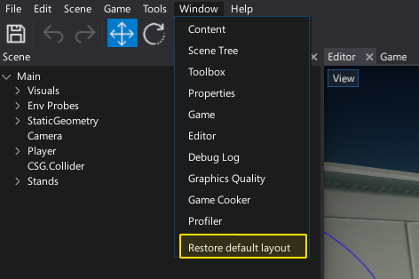

# Editor Interface

Flax Editor's interface is made of **dockable windows** which can be rearranged, grouped, detached and docked.
You can drag and arrange a window by selecting and dragging the window header. It can be very useful when adapting the workspace for your need. Flax Editor saves the windows layout (per project) on closing, and every few seconds, to restore it on relaunch.

Useful shortcuts for faster navigation:
* **Ctrl + Tab** - next tab
* **Ctrl + Shift + Tab** - previous tab
* **Ctrl + W** - close tab
* **Ctrl + O** - finder tool to navigate to anything

## Main windows

The default layout contains a set of the most important elements:
* [Viewport](windows/viewport.md) - shows the game view. Used to navigate and edit scenes.
* [Content Window](windows/content-window.md) - shows the project assets. Used to create and manage your assets.
* [Scene Window](windows/scene-window.md) - shows the scene actors hierarchy. Used to view and modify the scene structure.
* [Properties Window](windows/properties-window.md) - shows properties of the selected objects. Used to view and edit the scene objects (scripts, actors).
* [Toolbox](windows/toolbox.md) - provides useful tools for editing scenes. Used to spawn objects, paint the models and create a terrain.
* [Toolbar](windows/toolbar.md) - gives access to the essential editor features. Used to quickly test your game or save the changes with a single click.

## Default layout

The default windows layout can always be restored by using main menu option **Window -> Restore default layout**.

