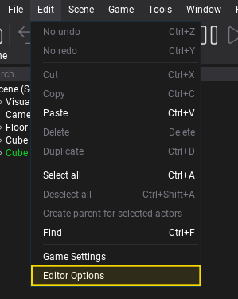
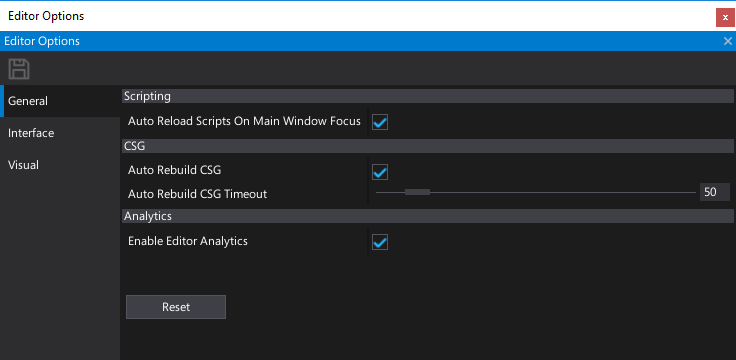
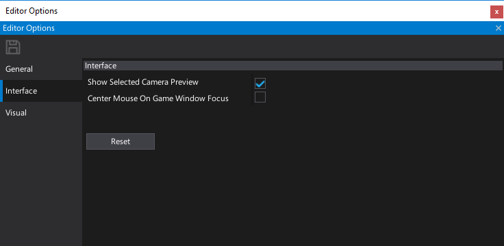
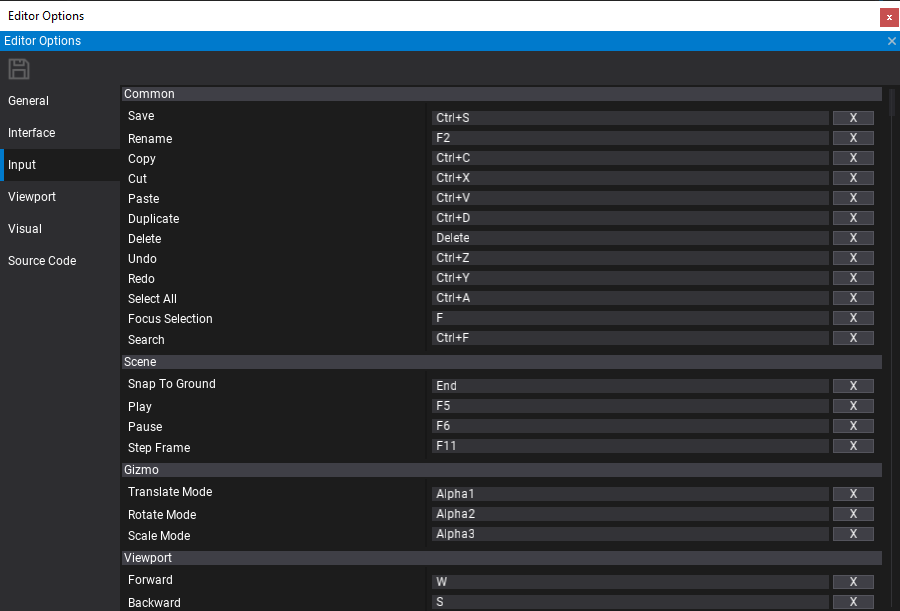
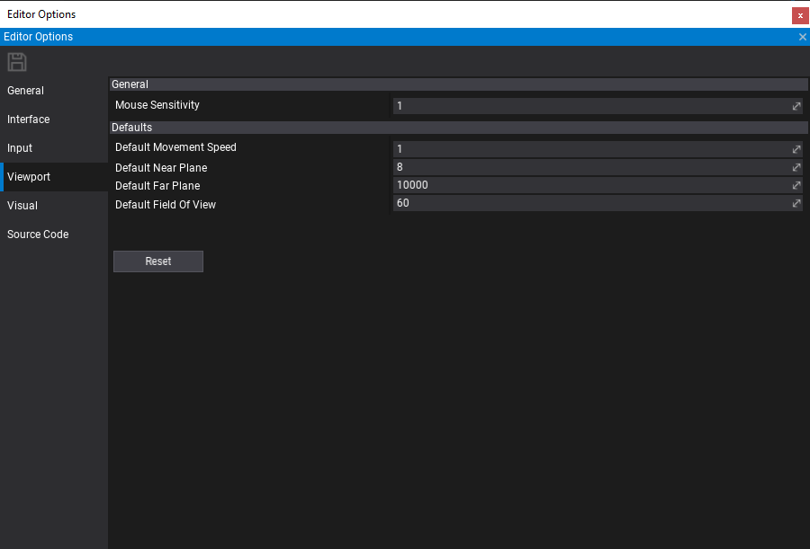
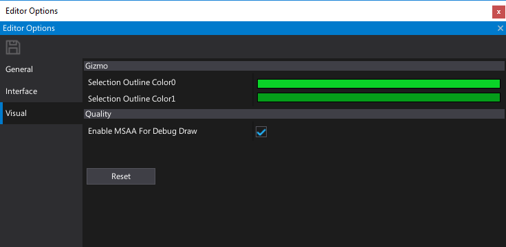

# Editor Options

Editor Options window allows to view and modify the settings used by the editor. Editor options are saved in local user cache folder and are shared globally between all installed Flax Editor instanced. By adjusting the settings you can customize Flax Editor for your need.

## Open options window

To open editor options window use main menu button **Tools -> Options**.

## Usage

You can modify the properties and press **Save** icon on a toolstrip to apply the changes. If you want to restore the settings for a given category press **Reset** button.

## General options

| Property | Description |
|--------|--------|
| **Startup Scene Mode** | The scene to load on editor startup. Possible options: <table><tbody><tr><th>Option</th><th>Description</th></tr><tr><td>**None**</td><td>Don't open scene on startup.</td></tr><tr><td>**Project Default**</td><td>The project default scene.</td></tr><tr><td>**Last Opened**</td><td>The last opened scene in the editor.</td></tr></tbody></table>|
| **Undo Actions Capacity** | Limit for the editor undo actions. Higher values may increase memory usage but also improve changes rollback history length. |
| **Auto Reload Scripts On Main Window Focus** | Determines whether reload scripts after a change on main window focus. |
| **Force Script Compilation On Startup** | Determines whether automatically compile game scripts before starting the editor. |
| **Auto Rebuild CSG** | Determines whether perform automatic CSG rebuild on brush change. |
| **Auto Rebuild CSG Timeout** | Auto CSG rebuilding timeout (in milliseconds). Use lower value for more frequent and responsive updates but higher complexity. |
| **Auto Rebuild Nav Mesh** | Determines whether perform automatic NavMesh rebuild on scene change. |
| **Auto Rebuild Nav Mesh Timeout** | Auto NavMesh rebuilding timeout (in milliseconds). Use lower value for more frequent and responsive updates but higher complexity. |
| **Enable Auto Save** | Enables or disables auto saving changes in edited scenes and content. |
| **Auto Save Frequency** | The interval between auto saves (in minutes). |
| **Auto Save Scenes** | Enables or disables auto saving opened scenes. |
| **Auto Save Content** | Enables or disables auto saving content. |
| **Enable Editor Analytics** | Enables or disables anonymous editor analytics service used to improve editor experience and the quality. |

## Interface options

| Property | Description |
|--------|--------|
| *Interface* ||
| **Interface Scale** | Editor User Interface scale. Applied to all UI elements, windows and text. Can be used to scale the interface up on a bigger display. Editor restart required. |
| **Use Native Window System** | Determines whether use native window title bar. Editor restart required. |
| **Show Selected Camera Preview** | Determines whether show selected camera preview in the edit window. |
| **Center Mouse On Game Window Focus** | Determines whether center mouse position on window focus in play mode. Helps when working with games that lock mouse cursor. |
| **Debug Log Timestamps Format** | The timestamps prefix mode for debug log messages. Possible options: <table><tbody><tr><th>Option</th><th>Description</th></tr><tr><td>**None**</td><td>No prefix.</td></tr><tr><td>**Utc**</td><td>The UTC time format.</td></tr><tr><td>**Local Time**</td><td>The local time format.</td></tr><tr><td>**Time Since Startup**</td><td>The time since startup (in seconds).</td></tr></tbody></table> |
| *Output Log* ||
| **Timestamps Format** | The timestamps prefix mode for output log log messages. Possible options: <table><tbody><tr><th>Option</th><th>Description</th></tr><tr><td>**None**</td><td>No prefix.</td></tr><tr><td>**Utc**</td><td>The UTC time format.</td></tr><tr><td>**Local Time**</td><td>The local time format.</td></tr><tr><td>**Time Since Startup**</td><td>The time since startup (in seconds).</td></tr></tbody></table> |
| **Show Log Type** | Determines whether show log type prefix in output log messages. |
| **Text Font** | The output log text font. |
| **Text Color** | The output log text color. |
| **Text Shadow Color** | The output log text shadow color. |
| **Text Shadow Offset** | The output log text shadow offset. Set to 0 to disable this feature. |
| *Play In-Editor* ||
| **Focus Game Window On Play** | Determines whether auto-focus game window on play mode start. |
| *Fonts* ||
| **Title Font** | The title font for editor UI. |
| **Large Font** | The large font for editor UI. |
| **Medium Font** | The medium font for editor UI. |
| **Small Font** | The small font for editor UI. |

## Input options

Use this section to modify the input shortcuts binding used by the editor. By pressing `X` button you can remove the binding.

## Viewport options

| Property | Description |
|--------|--------|
| **Mouse Sensitivity** | The mouse movement sensitivity scale applied when using the viewport camera. |
| **Default Movement Speed** | The default movement speed for the viewport camera (must match the dropdown menu values in the viewport). |
| **Default Near Plane** | The default near clipping plane distance for the viewport camera. |
| **Default Far Plane** | The default far clipping plane distance for the viewport camera. |
| **Default Field Of View** | The default field of view angle (in degrees) for the viewport camera. |

## Visual options

| Property | Description |
|--------|--------|
| **Show Selection Outline** | If checked, the selection outline will be visible. |
| **Selection Outline Color 0** | The first color of the selection outline gradient. |
| **Selection Outline Color 1** | The second color of the selection outline gradient. |
| **Gizmo Size** | The transform gizmo size. |
| **Highlight Color** | The color used to highlight selected meshes and CSG surfaces. |
| **Enable MSAA For DebugDraw** | Determines whether enable MSAA for DebugDraw primitives rendering. Helps with pixel aliasing but reduces performance. |

## Source Code options

| Property | Description |
|--------|--------|
| **Source Code Editor** | The source code editing IDE to use for project and source files accessing. |

## Custom options

Editor supports extending the options by adding custom settings. This can be used by the editor plugins. To learn how to do it see the related [tutorial here](../../scripting/tutorials/custom-editor-settings.md).
