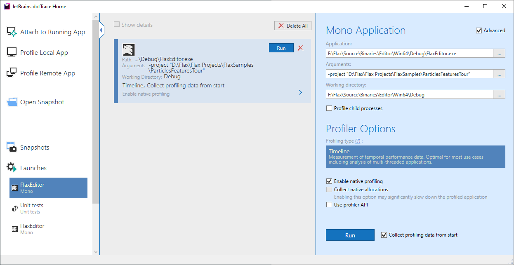

# dotTrace Profiler

**dotTrace** is .NET performance profiler by JetBrains. It can be downloaded [here](https://www.jetbrains.com/profiler).

With dotTrace you can detect performance bottlenecks in a game. It can get accurate data on calls execution time, memory allocations and filesystem access.

## Setup

Open dotTrace and select option **Profile Local App** -> **Mono Application**. Then pick game executable. When launching Flax Editor fill also the command line arguments with your project path. Optionally, under Advanced options you can Enable native profiling to get C++ code statistics. Then hit **Run** button and use profiler session window to capture the snapshots.

## Profiling Snapshots

dotTrace profiler snapshots provide various informations about the Flax game performance. Those can be used to deeply analyze and monitor the runtime. To learn more about it please visit official documentation [here](https://www.jetbrains.com/profiler/documentation/documentation.html).
