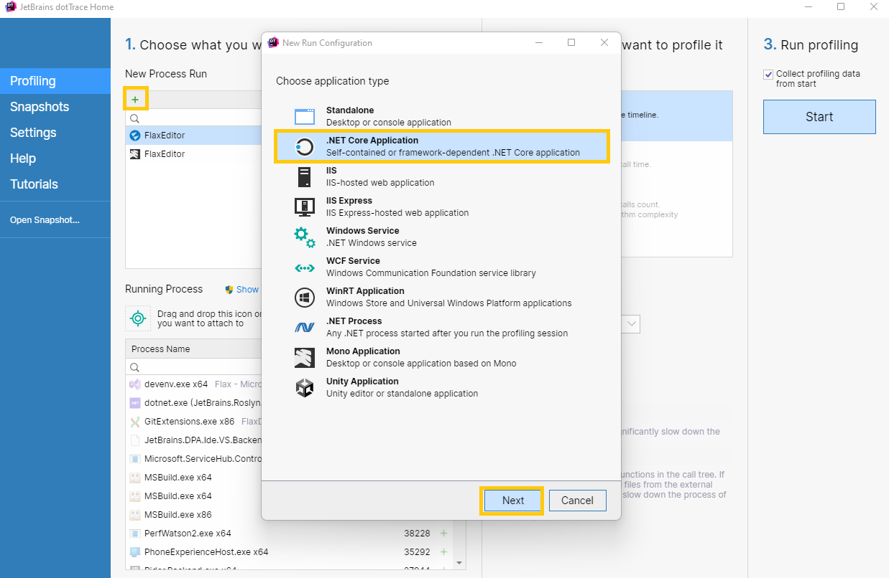
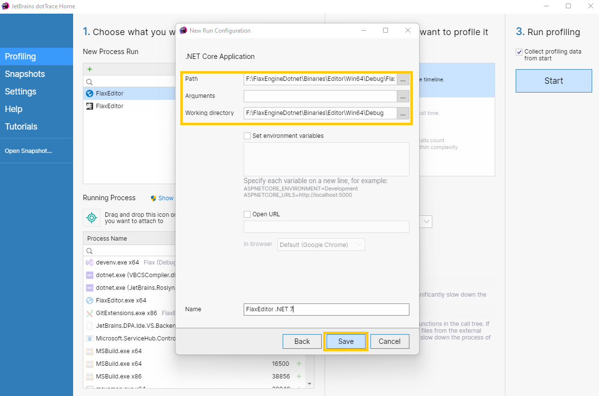
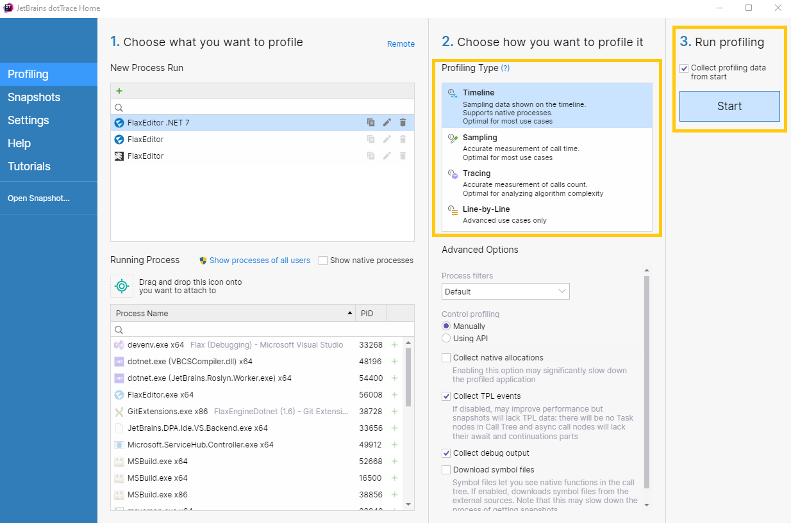
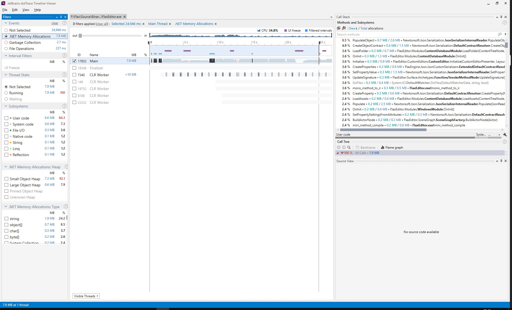

# dotTrace Profiler

**dotTrace** is .NET performance profiler by JetBrains. It can be downloaded [here](https://www.jetbrains.com/profiler).

With dotTrace you can detect performance bottlenecks in a game. It can get accurate data on calls execution time, memory allocations and filesystem access.

## Setup

Open dotTrace and **add New Process Run** with **.NET Core Application** type (as shown above).

Then pick game executable (as shown above) to **Path** field. When launching Flax Editor fill also the command line arguments with your project path (if needed). Click **Save** and then you can use **Start** button to run the Flax with profilering tools attached.

## Profiling Snapshots

dotTrace profiler snapshots provide various informations about the Flax game performance. Those can be used to deeply analyze and monitor the runtime. To learn more about it please visit official documentation [here](https://www.jetbrains.com/profiler/documentation/documentation.html).
