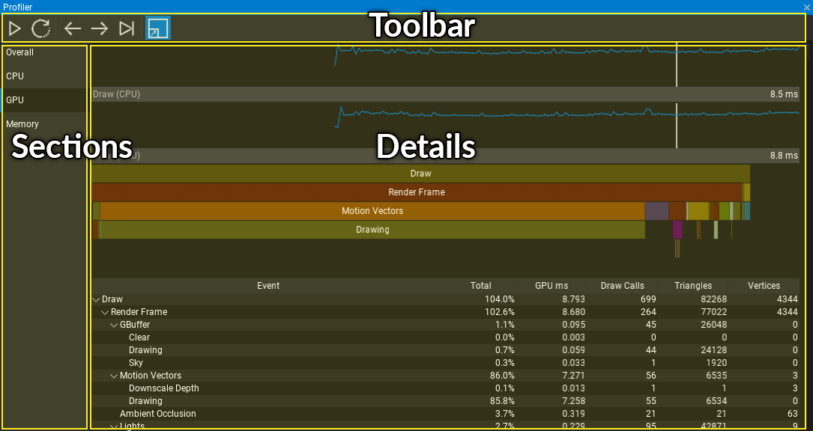
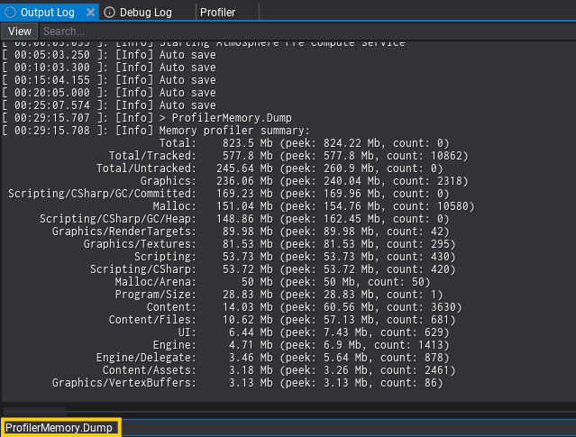
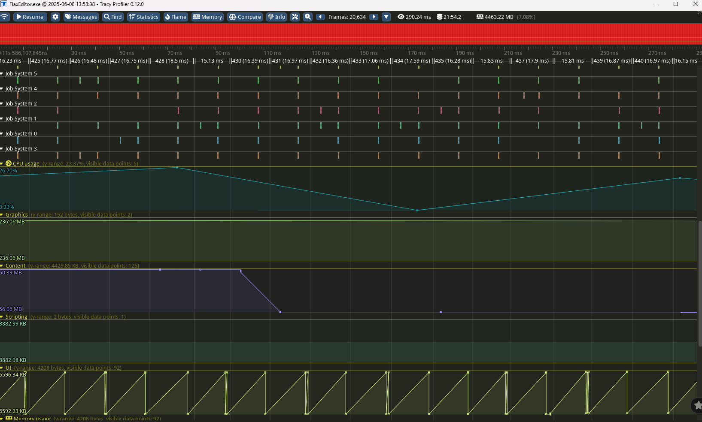
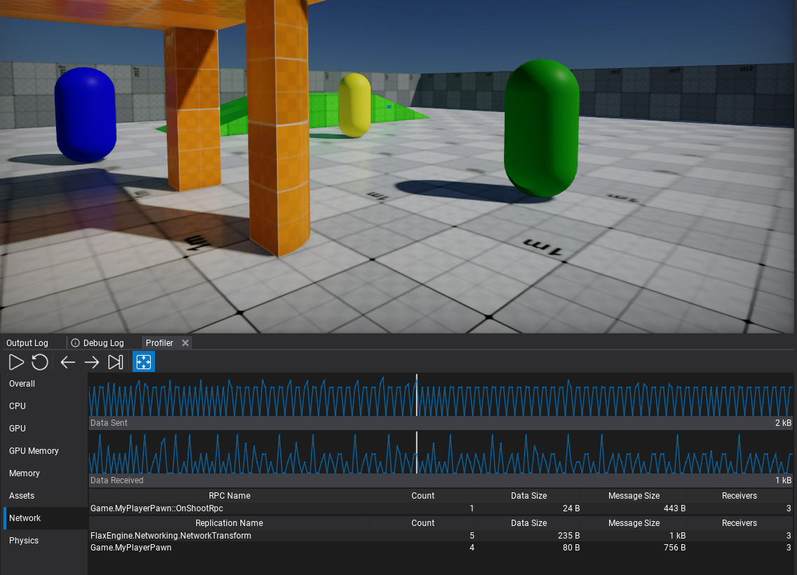

# Profiler

The **Profiler** window provides various ways of measuring game performance and helps the optimization process. It can be used to collect data about game performance right in the Editor.

## Interface



Profiler window is divided into 3 parts:
* Toolbar
* Sections list
* Details panel

## Sections

### Overall

The general profiling mode with major game performance charts and stats.

### CPU

The CPU performance profiling mode.

To add code section to be included in profile blocks use the following code:

# [C#](#tab/code-csharp)
```cs
Profiler.BeginEvent("MyFunction");
// do something
Profiler.EndEvent();
```
# [C++](#tab/code-cpp)
```cpp
#include "Engine/Profiler/Profiler.h"

PROFILE_CPU_NAMED("MyFunction"); // or PROFILE_CPU to use auto-name of the current function
// do something
```
***

### GPU

The GPU performance profiling mode.

To add code section to be included in profile blocks use the following code:

# [C#](#tab/code-csharp)
```cs
Profiler.BeginEventGPU("MyFunction");
// do something on GPU with GPUContext
Profiler.EndEventGPU();
```
# [C++](#tab/code-cpp)
```cpp
#include "Engine/Profiler/Profiler.h"

PROFILE_GPU("MyFunction"); // or PROFILE_GPU_CPU to inject both CPU and GPU profile event
// do something on GPU with GPUContext
```
***

### Memory


The memory profiling mode focused on breaking down system memory allocations. This includes separate stats for native memory allocation and managed C# allocations. Below the charts there is a table with memory usage broken down into certain engine categories such as: physics, graphics, level, audio, scripting, etc.

Table contains 4 collumns:
* name of the group,
* memory usage,
* peek of memory usage (since the start of the program),
* amount of active memory allocations.

By default, detailed memory allocations profiling is disabled (due to performance overhead). **To use memory profiling run Editor or Game with** `-mem` **command line**. It's supported in Development and Debug builds.

To add a code section to redirect specific memory allocation within into a group ,use:

# [C#](#tab/code-csharp)
```cs
ProfilerMemory.BeginGroup(ProfilerMemory.Groups.CustomGame0);
// do some native memory allocations
var testObject = new PointLight();
ProfilerMemory.EndGroup();

// Renaming custom group to show custom name in a profiler:
ProfilerMemory.RenameGroup(ProfilerMemory.Groups.CustomGame0, "MyGameLogic");
```
# [C++](#tab/code-cpp)
```cpp
#include "Engine/Profiler/ProfilerMemory.h"

PROFILE_MEM(CustomGame0);
// do some native memory allocations
auto testObject = New<PointLight>();

// Renaming custom group to show custom name in a profiler:
ProfilerMemory::RenameGroup(ProfilerMemory::Groups::CustomGame0, TEXT("MyGameLogic"));
```
***

[Debug Command](../../scripting/advanced/debug-commands.md) `ProfilerMemory.Dump` prints memory allocations stats (grouped) to the log. It shows top `20` categories (sorted by size). Argument `all` shows every used category (`ProfilerMemory.Dump all`), argument `file` saves the dump of all categories into a separate file (`ProfilerMemory.Dump file`, usefull for capturing snapshots for A/B diff).



[Tracy](tracy.md) profiler has integration with the main memory categories such as Graphics, Physics, UI which comes handly when profiling game remotely (eg. on Android or Switch platforms) to have an overview of memory usage.



### Network



The network data transfer sends/receives charts over game time. When using high-level networking it displays RPC methods and replication packets sent from the Editor to other peers.
