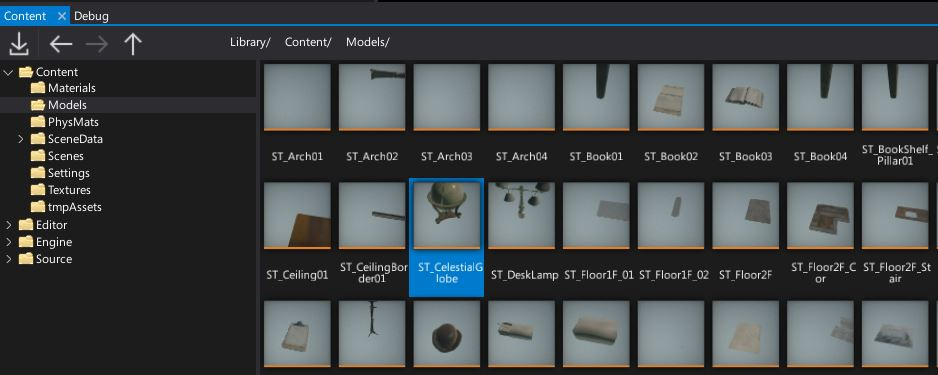
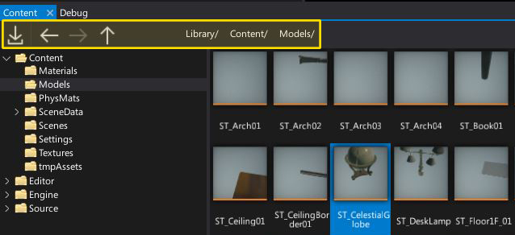
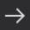
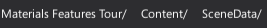
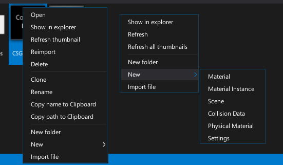

# Content Window

The **Content Window** displays your project assets and scripts. You can create new assets using the New Asset button or by dragging and dropping source files into the asset view. You can also drag and drop assets from the asset view to the different editors or the [properties window](properties-window.md) to add a reference to it.

The Left part of the window shows the project folders tree structure (*Editor* and *Engine* folders used by Flax are visible only in development builds). The main asset view panel shows the current location contents including all valid assets, scripts and subdirectories. You can adjust the size of these areas by using the splitter control visible in the middle.

## Toolstrip

| Control | Description |
|--------|--------|
|  | Opens the files importing dialog. Used to import textures, models and other resources. |
|  | Navigates backward in history. |
|  | Navigates forward in history. |
|  | Navigates up in history to the parent directory. |
|  | Navigation bar with current view location path split into a set of buttons. You can click on them to quickly navigate. |

## Context menu

If you **right-click** on an item (asset or folder) or on an asset view background, the context menu will show up.
It contains set options for workspace management and asset manipulation.
You can use the context menu to create new assets and scripts.

## Shortcuts

| Control | Action |
|--------|--------|
| **Arrows** | Navigation |
| **Ctrl + LMB** | Add/remove from selection |
| **Ctrl + A** | Select all items in a view |
| **Double-right-click** on asset icon | Open the asset editor |
| **Double-right-click** on asset name | Rename the asset |
| **Enter** | Open the asset editor (only if single item selected) |
| **Backspace** | Navigate back |
| **Delete** | Deletes the selected items |
| **Ctrl + D** | Duplicates the selected items |
| **Ctrl + Scroll Wheel** | Zoom in/out |

