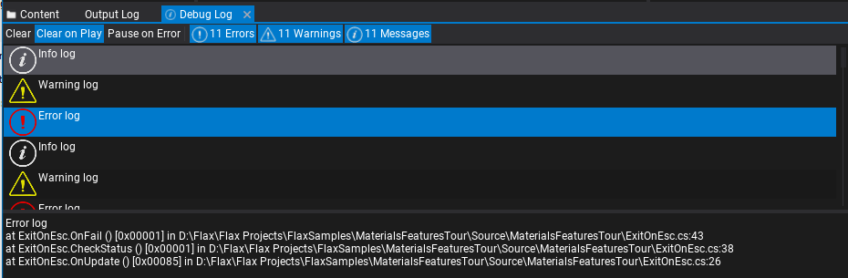
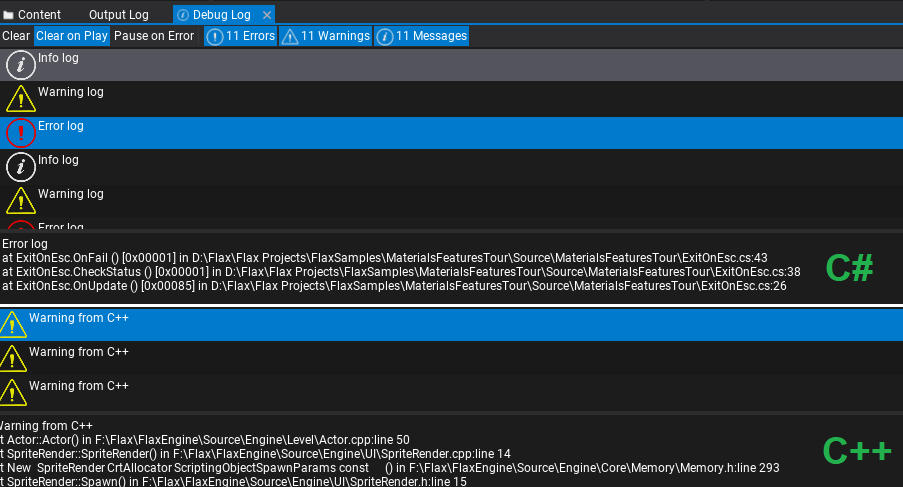

# Debug Log

The **Debug Log** is a utility window that displays the log messages from the game called via `Debug.Log`, `Debug.LogWarning`, `Debug.LogError` or `Debug.LogException` from C# or via `DebugLog` interface in C++. Can be used to detect problems with the game or to debug the logic via simple printing. Those logs are also passed into the [Output Log](output-log.md) and engine log output (console/file).

You can easily select and copy log entries (with `Ctrl+C` or *right-click* and use context menu) or open the code location that called the log function based on the captured stack trace (*double-click* or *right-click* and use context menu).

Debug Log window supports capturing stack trace from C++ and C# scripts.

