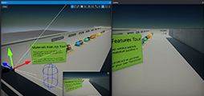
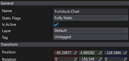
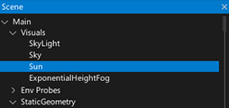
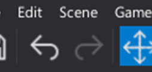
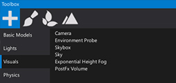

# The main editor windows

 

<h3><a href="viewport.md">Viewport</a></h3>

<h3><a href="content-window.md">Content Window</a></h3>

<h3><a href="properties-window.md">Properties Window</a></h3>

<h3><a href="scene-window.md">Scene Window</a></h3>

<h3><a href="toolbar.md">Toolbar</a></h3>

<h3><a href="toolbox.md">Toolbox</a></h3>

