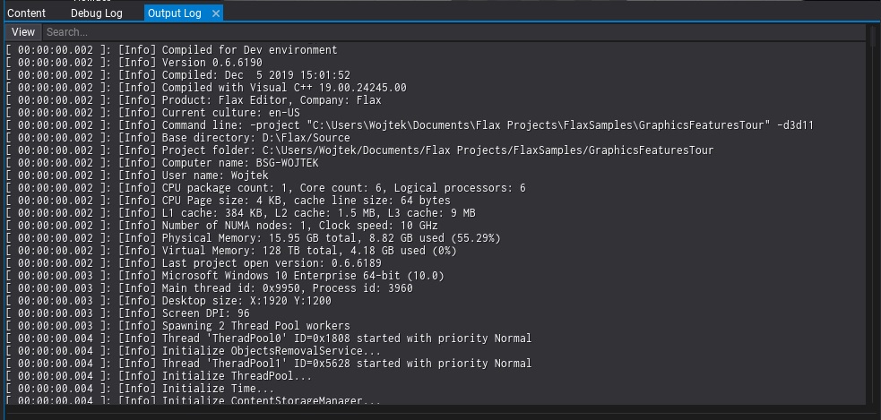

# Output Log

The **Output Log** is a utility window that displays the current engine log. Can be used to detect problems with the game or to analyze the engine workload.

You can easily select and copy parts of the log, use the *Search* box to filter entries or use the log types filter under the **View** dropdown menu. Also, loading log files is supported which can be used to read and analyze the logs from the build version of the game (eg. from Xbox dev build).
