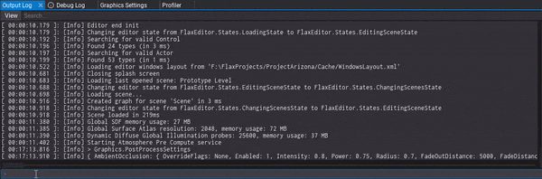

# Output Log

The **Output Log** is a utility window that displays the current engine log. Can be used to detect problems with the game or to analyze the engine workload.

You can easily select and copy parts of the log, use the *Search* box to filter entries or use the log types filter under the **View** dropdown menu. Also, loading log files is supported which can be used to read and analyze the logs from the build version of the game (eg. from Xbox dev build).

### Debug Commands

At the bottom of that window, there is an input command field that can be used to run [Debug Commands](../../scripting/advanced/debug-commands.md). You can type commands with an automatic search popup that displays similar commands based on the entered value. Use arrow keys to navigate around that popup list. The tab key can be used to autocomplete commands based on the best-found match. Finally, when input is empty you can use the arrow up key to navigate around the command history and re-try one of them again.
