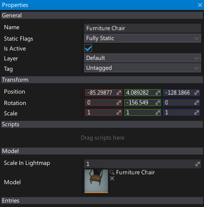

# Properties Window

**Properties Window** simply shows editable fields and properties of the selected objects.
If you [select](../../get-started/scenes/selecting-actors.md) any object on a scene (actor, mesh, brush surface, etc.) you will be able to modify its properties using this window.
It supports full undo/redo actions and uses [Custom Editors](../../scripting/custom-editors/index.md) pipeline to generate the UI.

