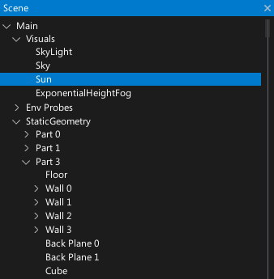
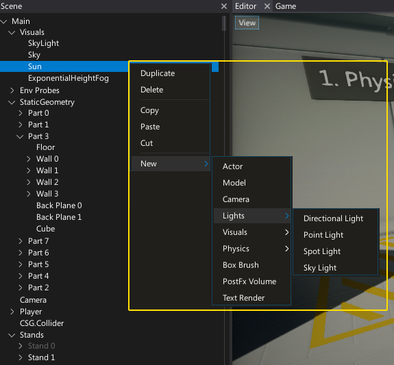

# Scene Window

The **Scene Window** shows a tree control with full hierarchy of the loaded scenes that updates automatically and supports multi-scene editing. 
Actors spawned or removed at runtime and all level changes are updated in real-time.

Every Actor is represented by a tree node (named after the actor).
Scene actors are the root nodes of the tree.
You can expand and collapse the scene hierarchy by using the arrow icons on the left of the node names.
To select one or more nodes use **LMB**, **Ctrl + LMB** or **Shift + LMB** to select a range of nodes.

You can select and drag an actor or selection of actors to reorder and reparent them.

## Context menu

Using **right-click** will display the context menu for the selected actor node. 
This will allow you to copy, paste, cut, duplicate, delete and add new actors.

## Shortcuts

| Control | Action |
|--------|--------|
| **Up/Down Arrows** | Navigation |
| **Left/Right Arrows** | Collapse/expand the node |
| **Ctrl + LMB** | Add/remove from selection |
| **Shift + LMB** | Select range of nodes |
| **Ctrl + A** | Select all items in a view |
| **Double-right-click** on actor | Moves the editor [viewport](viewport.md) to see this actor |
| **Delete** | Deletes the selected actors |
| **Ctrl + D** | Duplicates selected actors |
| **Ctrl + F** | Starts searching |
| **Ctrl + S** | Saves all the project changes (modified scenes and assets) |
| **Ctrl + Z** | Performs the undo action |
| **Ctrl + Y** | Performs the redo action |
| **Ctrl + X** | Cuts selected actors |
| **Ctrl + C** | Copies selected actors |
| **Ctrl + V** | Pastes copied actors |
| **F5** | Starts in-editor playmode |
| **F11** | Steps one frame during pause in in-editor playmode |
