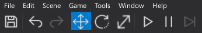

# Toolbar

The **Toolbar** is a part of the main editor window and contains a set of useful buttons.
You can use it to quickly save the project or pause the in-editor simulation.

| Button | Description |
|--------|--------|
|  | Saves all modified scenes and assets (Ctrl+S). |
|  | Reverts the last scene modification action (Ctrl+Z). |
|  | Replies the last scene modification action (Ctrl+Y). |
|  | Changes Gizmo tool mode to *Translate* (1). |
|  | Changes Gizmo tool mode to *Rotate* (2) |
|  | Changes Gizmo tool mode to *Scale* (3) |
|  | Build scenes data - CSG, navmesh, static lighting, env probes (Ctrl+F10). |
|  | Starts/Stops the simulation (F5). |
|  | Pauses the simulation. Game logic and physics simulation will freeze. |
|  | Steps one frame in simulation (only in pause mode). |

