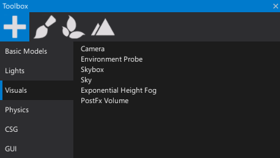
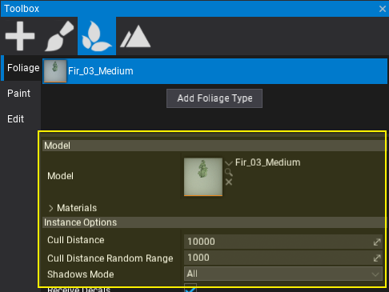

# Toolbox

The **Toolbox** window helps with rapid object spawning, level designing and advanced scene editing.
It contains several modes, each contained in a separate tab.
You can switch between these modes by clicking on their corresponding icon (plus icon, brush icon, etc.).

## Spawning

The default and most used toolbox mode is **Spawning**.
In this mode you can add new actors to the scene by dragging them into the [viewport](viewport.md) or [scene window](scene-window.md).
Actor types are grouped into categories so you can quickly find the desired object.

## Vertex Painting

The vertex painting tab supports painting a selected model instance with a color. To learn more about this tool see the related documentation [here](../../graphics/models/vertex-painting.md)

## Foliage Painting

The foliage editing tab supports different modes for foliage editing including spawning, removing, and managing tools. To learn more about foliage see the related documentation [here](../../foliage/index.md)

## Terrain Carving

The terrain carving tab supports different modes for terrain editing including carving, painting and managing tools.
To learn more about terrain see the related documentation [here](../../terrain/index.md)
