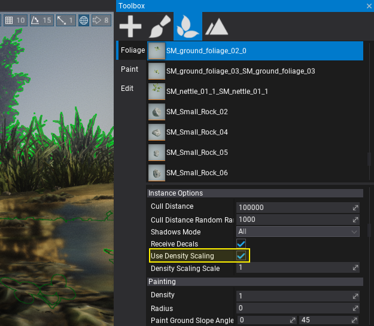
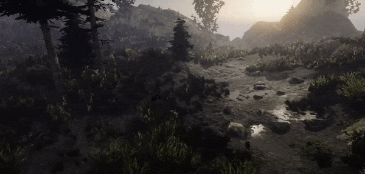

# Foliage Density Scaling

Foliage actor can contain hundreds of thousands of foliage instances. In order to keep its performance fine, it uses some advanced algorithms to optimize the rendering. However in many cases when shipping your game into consoles or mobile devices it is requried to tweak the foliage density.

## Using density scaling

Firstly enable this feature on given types of the foliage. You can also adjust the scale factor per type to improve the usage in some cases (eg. balance scaling different types of grass).

Then control the `Foliage.GlobalDensityScale` from you game code. The default value is 1 which disabled any scaling. Set it to 0.5 to reduce amount of scalable foliage by 2. Each foliage instance has own stable and serialized random number that is used for this operation so the density scaling is constant.

