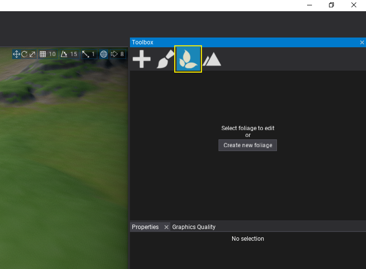
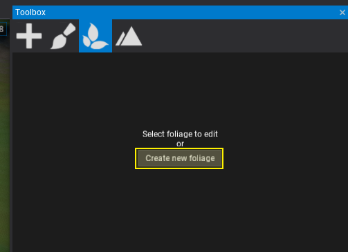
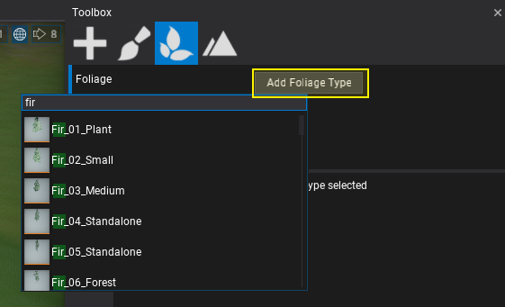
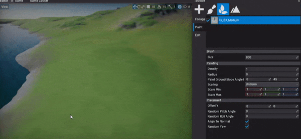

# HOWTO: Create foliage

In this tutorial you will learn how to create a new foliage actor and add it to your scene.

## 1. Open scene

Create or open existing level to add new foliage to it. Flax supports many foliage objects per scene so there is no limit.

## 2. Select *Foliage* tab in Toolbox

Open Toolbox window and pick the foliage tab.

## 3. Use *Create new foliage* button

Press the **Create new foliage** button to add new foliage actor instance in your scene.

## 3. Add foliage type

After you create new foliage actor, Editor will auto-select it. When foliage actor is selected the Toolbox tab shows more information. You can use it to modify the foliage types collection, spawn and remove foliage instances, or edit single instances using gizmo and properties panel.

Use **Add Foliage Type** button and pick a foliage type model asset (it must be unique within the foliage actor).

## 4. Edit foliage type properties

Now, you can select the foliage type and edit its properties. To learn more about foliage types properties see [this page](../types.md).

## 5. Paint foliage

The last step is to actually spawn some foliage instances into your level. To do so, select **Paint** tab and use editor viewport to paint foliage with a brush. You can adjust **Brush Size** in the properties panel as well as selected foliage type placement and painting properties.

Use *left mouse button* to paint over the object surfaces or hold *Control* key to remove instances.

To paint with a given subset of foliage types use the checkboxes in the foliage types list to choose what type to use during painting.

