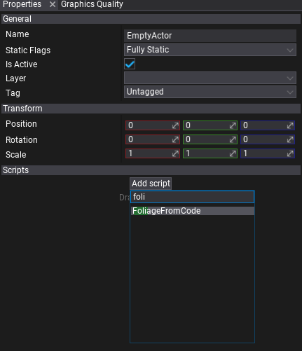
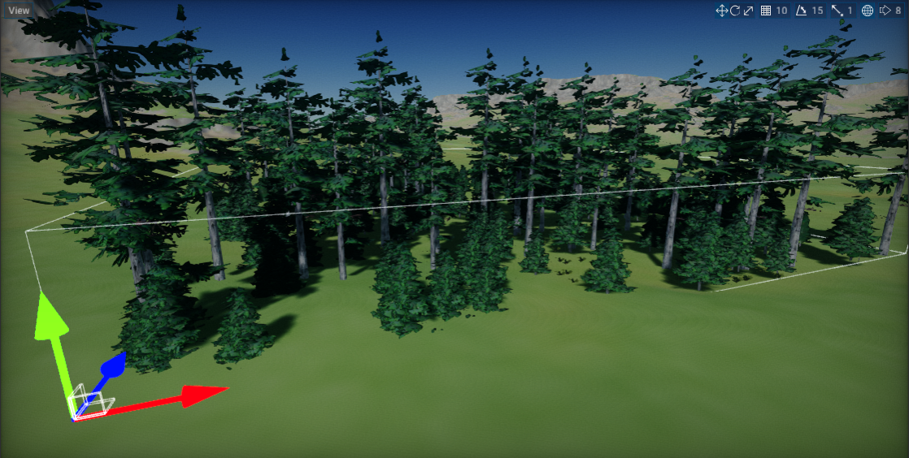

# HOWTO: Create foliage from code

In this tutorial, you will learn how to create foliage from code at-runtime. This technique can be used to implement using foliage in games that generate the world at runtime (eg. RTS games).

## 1. Create new script

You can use [this tutorial](../../scripting/new-script.md) to learn how to do it.

## 2. Implement foliage generator

Write the following code to implement example foliage generator.

```cs
using System;
using System.ComponentModel;
using System.Threading.Tasks;
using FlaxEngine;
using FlaxEngine.Utilities;

public class FoliageFromCode : Script
{
    private Foliage _foliage;

    public struct FoliageType
    {
        [Tooltip("The foliage type mode asset.")]
        public Model Model;

        [DefaultValue(10.0f), Tooltip("The instances spawning density.")]
        public float Density;
    }

    [Tooltip("The generated foliage instances bounds (in actor local-space).")]
    public Vector2 Bounds = new Vector2(5000);

    [Tooltip("The foliage types collection.")]
    public FoliageType[] Types;

    private void Start()
    {
        // Create new dynamic foliage actor and add it to the scene
        _foliage = Foliage.New();
        _foliage.HideFlags = HideFlags.DontSave;
        _foliage.Name = "My Foliage";
        _foliage.Parent = Actor;

        // Generate foliage using the async task to prevent game stalls
        // You can also use C# thread to perform this work
        // Your game can display progress bar or loading screen while foliage is being generated
        Task.Run(new Action(GenerateFoliage));
    }

#if FLAX_EDITOR
    private void OnDebugDrawSelected()
    {
        // Draw bounds area in editor
        var bounds = new BoundingBox(Vector3.Zero, new Vector3(Bounds.X, 1000.0f, Bounds.Y));
        bounds = BoundingBox.Transform(bounds, Actor.LocalToWorldMatrix);
        DebugDraw.DrawBox(bounds, Color.AliceBlue);
    }
#endif

    private void GenerateFoliage()
    {
        if (Types == null || Types.Length == 0)
        {
            Debug.LogError("No foliage types defined!");
            return;
        }

        // Setup foliage types (do it before adding instances to improve performance)
        for (int typeIndex = 0; typeIndex < Types.Length; typeIndex++)
        {
            var type = Types[typeIndex];
            _foliage.AddFoliageType(type.Model);
        }

        // Spawn instances using random generation within the bounds
        var boundsArea = Bounds.X * Bounds.Y;
        var rand = new Random();
        for (int typeIndex = 0; typeIndex < Types.Length; typeIndex++)
        {
            var type = Types[typeIndex];
            var instancesCount = boundsArea * type.Density / (1000.0f * 1000.0f);

            for (int i = 0; i < instancesCount; i++)
            {
                var instance = new Foliage.Instance();
                instance.Type = typeIndex;
                instance.Transform.Translation = new Vector3(rand.NextFloat() * Bounds.X, 0, rand.NextFloat() * Bounds.Y);
                instance.Transform.Scale = new Vector3(rand.NextFloat(0.7f, 1.3f));
                _foliage.AddInstance(ref instance);
            }
        }

        // Ensure to update quad-tree after editing foliage
        _foliage.RebuildClusters();
    }
}
```

## 3. Add script to scene

Drag and drop the script to empty actor or use *Properties* window and **Add script** button.



## 4. Setup foliage types

Add foliage types descriptors by specifying foliage type model and spawn density.


## 5. Test it in Play Mode

Press **Play** button on the toolbar or hit *F5* key and see the results. Foliage should quickly generate in a background. You can use it in your games that need to generate a foliage at runtime or in the editor.


