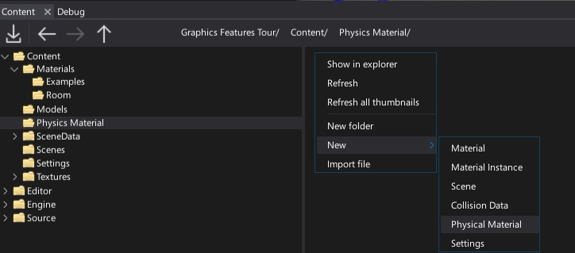

# Creating Assets

Some asset types can be imported from the external file (models, textures, etc.) and some assets can be created right in the editor (scenes, physical materials, etc.). In both cases use [Content Window](../../editor/windows/content-window.md).

## Creating assets

For example to create a new [physical material](../../physics/physical-material.md) asset, simply navigate to the Content directory in the *Content* window, then right-click and choose option **New -> Physics -> Physical Material**. Specify its name and press *Enter*.

## Importing assets

The easiest way to import one or more textures/models/etc. is to drag them from *Explorer* to the *Content* window.

Alternatively, you can use **Import** button in a *Content* window toolbar and then select files to import.

After choosing the files **Import file settings** dialog shows up. It's used to specify import options per asset. In most cases the default values are fine and you can just press the **Import** button.

