# Assets

**Asset** is a file that holds a resource data.
For instance, texture, model or scene file are assets.
An asset can be imported from file created outside of Flax, such as a 3D model, an audio file or a texture.
There are also some asset types that can be created inside the Flax Editor, such as a Physical Material, or a Scene.

This section covers the basic principles of working with assets in Flax.

## Assets documentation

<a href="creating-assets.md">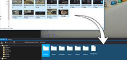</a>
<h3><a href="creating-assets.md">Creating assets</a></h3>

Learn how to create and import assets in editor.

<a href="using-assets.md">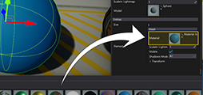</a>
<h3><a href="using-assets.md">Using assets</a></h3>

Learn how to use assets in editor and scripts.

<a href="../../editor/windows/content-window.md">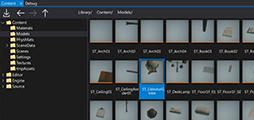</a>
<h3><a href="../../editor/windows/content-window.md">Content window</a></h3>

View Content Window documentation.

## Asset types

<h3><a href="../../graphics/models/index.md">Models</a></h3>

<a href="../../graphics/textures/index.md">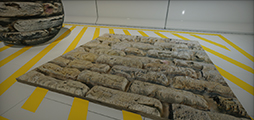</a>
<h3><a href="../../graphics/textures/index.md">Textures</a></h3>

<a href="../../graphics/textures/cube-textures.md">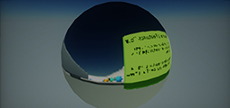</a>
<h3><a href="../../graphics/textures/cube-textures.md">Cube Textures</a></h3>

<a href="../../graphics/lighting/ies-profiles.md">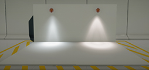</a>
<h3><a href="../../graphics/lighting/ies-profiles.md">IES Profiles</a></h3>

<a href="../../graphics/materials/index.md">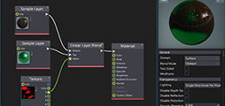</a>
<h3><a href="../../graphics/materials/index.md">Materials</a></h3>

<a href="../../graphics/materials/instanced-materials/index.md">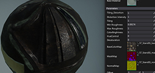</a>
<h3><a href="../../graphics/materials/instanced-materials/index.md">Instanced Materials</a></h3>

<h3><a href="../scenes/index.md">Scenes</a></h3>

<a href="../../physics/physical-material.md">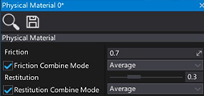</a>
<h3><a href="../../physics/physical-material.md">Physical Materials</a></h3>

<a href="../../physics/colliders/collision-data.md">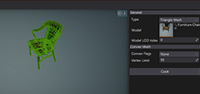</a>
<h3><a href="../../physics/colliders/collision-data.md">Collision Data</a></h3>

<h3><a href="../prefabs/index.md">Prefab</a></h3>

<a href="../../scripting/tutorials/custom-asset.md">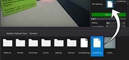</a>
<h3><a href="../../scripting/tutorials/custom-asset.md">Custom Assets</a></h3>

<a href="../../animation/skinned-model/index.md">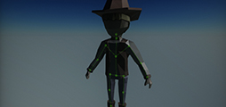</a>
<h3><a href="../../animation/skinned-model/index.md">Skinned Model</a></h3>

<a href="../../animation/anim-graph/index.md">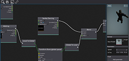</a>
<h3><a href="../../animation/anim-graph/index.md">Anim Graph</a></h3>

<a href="../../animation/animation/index.md">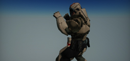</a>
<h3><a href="../../animation/animation/index.md">Animation</a></h3>

<a href="../../animation/skeleton-mask.md">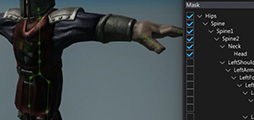</a>
<h3><a href="../../animation/skeleton-mask.md">Skeleton Mask</a></h3>

<h3><a href="../../ui/fonts/index.md">Font Asset</a></h3>

<a href="../../particles/particle-emitter.md">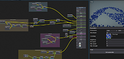</a>
<h3><a href="../../particles/particle-emitter.md">Particle Emitter</a></h3>

<a href="../../particles/particle-system.md">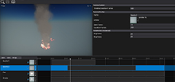</a>
<h3><a href="../../particles/particle-system.md">Particle System</a></h3>

<a href="../../animation/scene-animations/scene-animation.md">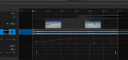</a>
<h3><a href="../../animation/scene-animations/scene-animation.md">Scene Animation</a></h3>

