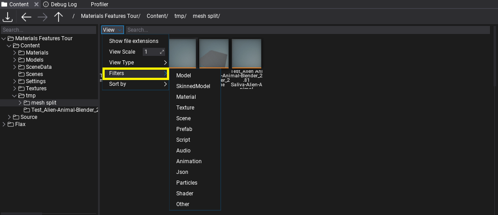
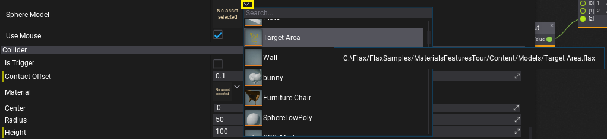
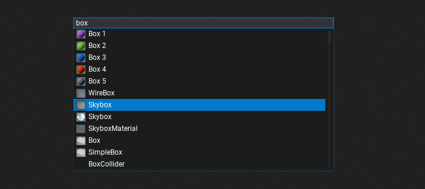
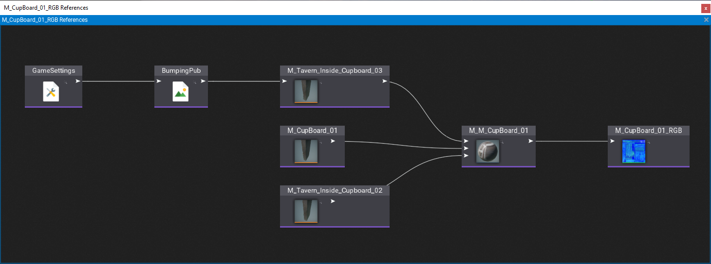

# Searching Assets

There are several ways to search for and find assets in the Editor.

## Content Window

The [Content Window](../../editor/windows/content-window.md) displays your project's assets and scripts. It's the main tool to navigate around project files and manage the workspace. It contains the full directory content tree for the project, engine and any referenced [plugin projects](../../scripting/plugins/plugin-project.md).

Both the folders hierarchy and the content view contain a *Search* input field on top which can be used to filter items by name. You can also use the **View -> Filters** menu to select one or more item types to display. This can be usefull when working with a specific asset type eg. textures.

## Asset Picker

The **Asset Picker** is an editor control for asset reference properties. It displays the currently selected asset and can be used to change the value. By using the dropdown arrow you can open the popup dialog which displays the list of all assets that can be assigned to the property and allows filtering them by name (use the search field).

## Content Finder

All Editor windows (except the *Game window*) have the keyboard shortcut **Ctrl+O** that opens the *Content Window* tool. It's a project-wide search tool which supports navigating to all assets, all scripts, all actors and more. After opening it simply start typing the name of the thing you want to view or edit.

You can also use special tags to filter search results:
* `:<type>` - filters the items by typename. For example: `cube:texture` will show all textures that contain `cube` in a name, `:scene` will show all scenes.

Content Finder shortcut can be configured in the Editor input options.

### Reference Viewer

The [Asset References Viewer](../../editor/advanced/asset-references.md) is a built-in tool for displaying a graph of assets referencing the given asset and assets referenced by that asset (a heirarchy). To use it simply *right-click* on an asset in a *Content Window* and select the opton **Show asset references graph**. It will display the graph with direct references between the assets. It can be used to analyze the project's content. For instance, you can find all textures used by a given model asset to verify their quality or texture group.
