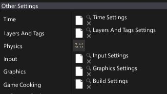

# Using Assets

Assets are used by almost all parts of the engine.
Model actors need materials and 3D model assets to draw the geometry, Environment probes need cube textures to use them for reflections rendering and so on.
Every asset is identified by its own **unique ID**.
This means you can rename and move your assets around the Content workspace without resictions.
Also if you reference an asset in your script, only the asset id is serialized to keep the linkage.

## Use asset

In the editor, for most of the time, to use an asset simply drag and drop it into the asset picker control.


Some asset types (models, materials, etc.) support direct drag and drop into the editor viewport.
For example, if you drag and drop a model into the scene it will spawn a Static Model instance.
You can also drag and drop material or material instance onto the model to set its material.


## Asset picker

Asset references can be modified in the Editor using an **asset picker**. This control allows previewing the asset thumbnail, select an asset in a *Content* window or clear the reference. If you double-click on the asset icon it will open the default editor for that asset's type. Also you can use the asset picker to drag the asset reference into the other pickers.


Some asset pickers are smaller to reduce UI complexity:



## Assets in scripts

All asset types can also be used at runtime in your C# scripts. For example, declare a public field in your script and use the value.

```cs
public class SetMaterial : Script
{
    [Tooltip("Material to assign to the model")]
    public Material Material;

    public override void OnStart()
    {
        Actor.As<StaticModel>().SetMaterial(0, Material);
    }
}
```
