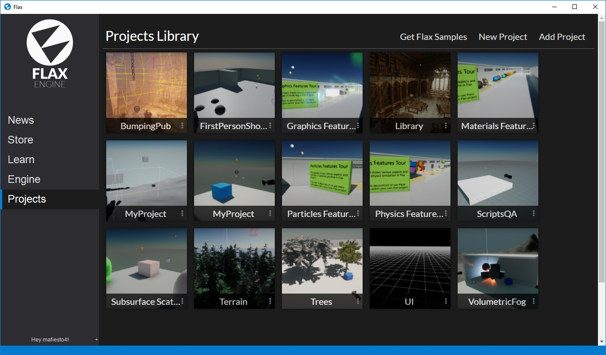
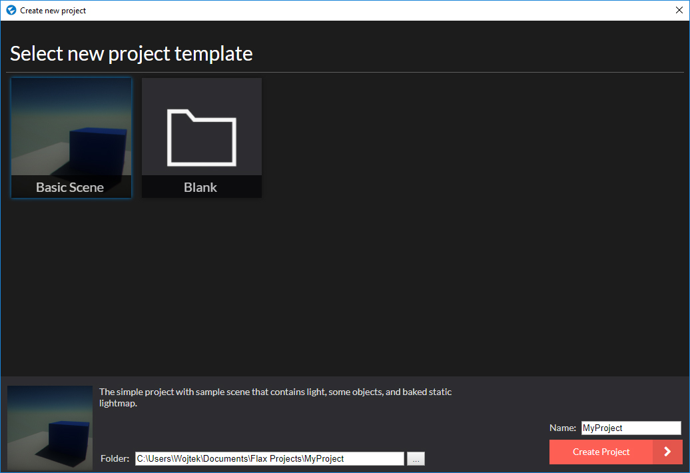

# Create new project

After you [get Flax](get-flax.md), navigate to the **Projects** page in the Flax Launcher. Here you can view your projects library. You can open existing projects by double clicking on them (the default engine version) and you can use the context menu (3 dots near its name label) to delete, unlink or view project location.

If it's your first time with Flax we recommend you click **Get Flax Samples** to download a collection of free projects that showcase various engine features and can be used as a base for your journey with Flax. Flax Samples are free and the repository is [available here](https://github.com/FlaxEngine/FlaxSamples).

You can also add an existing project from your drive using the **Add Project** button. Simply pick the folder that contains the project and it will appear in your project's library.

To create a new project use the **New Project** button in the upper right corner of the page and follow the dialog instructions. You can pick a template, specify the project name and the target location. After that click the **Create Project** button and open it via double click or using the context menu (3 dots) in the projects library.

Now it's time to [learn about the Flax Editor](editor.md)...

## Project from command line

An alternative way to create a new project without using Flax Launcher is to run the Flax Editor executable with `-new -project <new_project_path>` to create a new project inside a specified folder.

## Next Step

    
    <h3><a href="editor.md">Editor</a></h3>
    
Learn how to work with Flax Editor.

