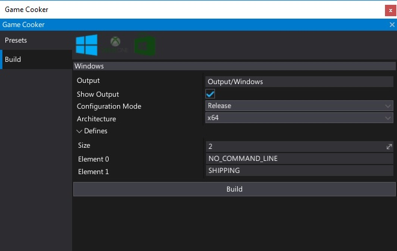
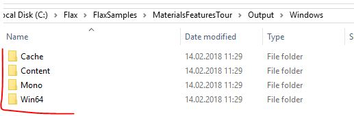

# Distribute your game

When you're ready to publish your game, create a release build with [Game Cooker](../editor/game-cooker/index.md), and distribute it. Please follow these steps.

## 1. Create a game and run it through Quality Assurance

Before you can publish your game you must first ideally have a developed game and perform enough QA to deliver a high-quality product.

## 2. Follow the guidelines

All commercial games made using the Flax Engine must follow various guidelines. It's required by the [EULA](https://flaxengine.com/licensing/) which has to be accepted before installing the engine. It does not affect truly uncommercial products (educational, totally free). Please visit [Commercial Product Release Guidelines](https://flaxengine.com/release/) page to learn more.

## 3. Build a game

Now to prepare the final build. Remember to use **Release** mode and remove any debug/testing code sections with [preprocessor variables](../scripting/preprocessor.md). Use the [Game Cooker](../editor/game-cooker/index.md) tool to generate the game files for a target platform.

## 4. Distribute your game

Every platform has it's own building process and custom output data format but in most cases simply grab the files from the *Output* directory. 
How you distribute it is up to you.

