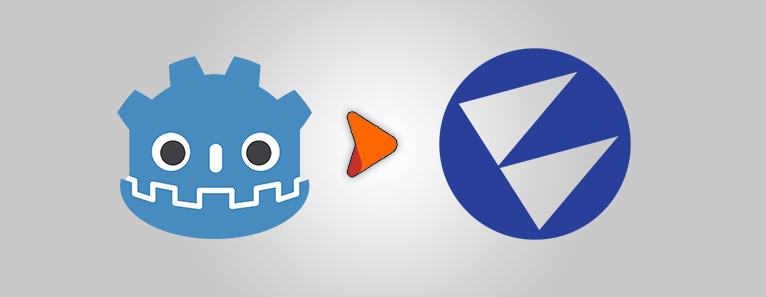
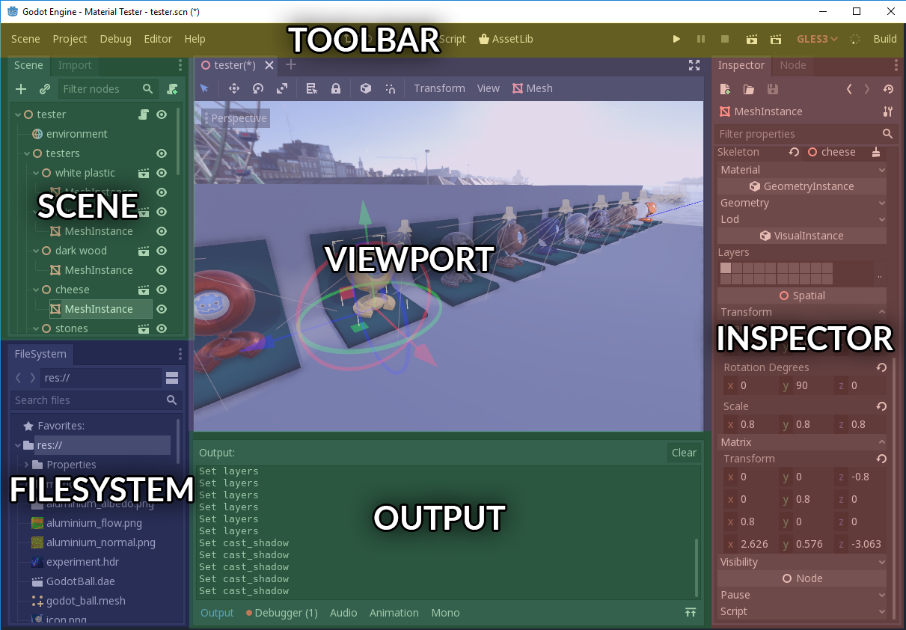

# Flax for Godot developers



Flax and Godot have many similarities and share many concepts, however, there are a few differences. This page helps Godot Engine developers to translate their existing Godot experience into the world of Flax Engine.

> [!Warning]
> Warning! Once you switch from Godot to Flax you will love this engine!

## Editor

Flax Editor and Godot Editor are very similar. You can see the color-coded, highlighted areas on screenshots of both editors that have common functionalities. Flax Editor layout is also highly customizable so you can drag and drop windows around to adapt the editor to your workflow.




> [!Tip]
> With Flax, you can create huuuge 3D games and get great performance compared to Godot.

## Terminology

This section contains the most common terms used in Godot and their Flax equivalents (or rough equivalents). Flax keywords link directly to more in-depth information inside the documentation.

| Godot | Flax |
|--------|--------|
| **Node** | [Actor](../scenes/actors.md) |
| **Script** | [Script](../../scripting/index.md) |
| **Scene** | [Scene Window](../../editor/windows/scene-window.md) |
| **Inspector** | [Properties Window](../../editor/windows/properties-window.md) |
| **FileSystem** | [Content Window](../../editor/windows/content-window.md) |

## Project


Flax projects structure is well standardized and contains: **Cache** folder (similar to `.import` folder in Godot), **Content** folder and **Source** folder. All game assets are in Content directory, while all scripts are in Source directory. So there is less mess with assets and scripts.

Flax also generates a solution and project files for your game C# scripts.

See [Flax projects structure](../project-structure.md) page to learn more about the projects in Flax Engine.

## Assets

Flax uses two types of asset types: **binary files** (with `.flax` extension) and other **text files** (mostly in JSON format like scenes, prefabs, etc.). When you import model or texture it gets processed and converted into binary representation used by the engine at runtime that is well optimized for scalability and streaming. Flax doesn't use `.import` files like Godot.

Flax supports the most popular asset files formats (for 3D models and textures) so you can import your game content.

See [Assets](../assets/index.md) page to learn more about importing and using game assets.

## Node vs Actor

Flax uses similar conpet to describe the scene contents. Instead of using Nodes we use [Actors](../scenes/actors.md). Each Actor has its own type (e.g. point light, box collider) and a collection of attached scripts.

In Flax, Scene object is also an Actor so you can access it like any other Actor. This means that Scenes can have their own scripts and be transformed like other objects.

If you want to create multiple instances of compound object you can use [Prefabs](../prefabs/index.md) that can be used for instancing game objects.

## Scripting

> [!Tip]
> Scripting in C# and C\+\+ is feature-complete and production-ready in Flax (compared to Godot). Also, Visual Scripting offers far more tools and features.

When it comes to game scripting, Flax supports Visual, C# and C\+\+ scripts (similar to Godot). The are some differences in C# API. In fact, the whole C# API is an open-source project and can be found [here](https://github.com/FlaxEngine/FlaxAPI). All contributions are welcome.

* Godot
```cs
public class MyScript : Node
{
    public override void _Ready()
    {
        GD.print("It is Godot!");
    }
}
```

* Flax
```cs
public class MyScript : Script
{
	public override void OnStart()
	{
		Debug.Log("It is Flax!");
	}
}
```

See [Scripting](../../scripting/index.md) documentation to learn more about C# scripts in Flax.
