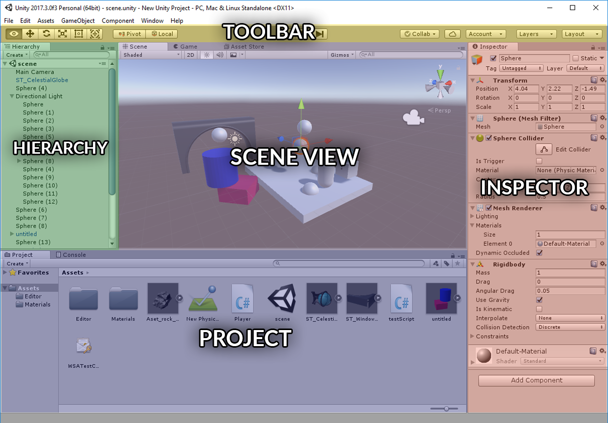
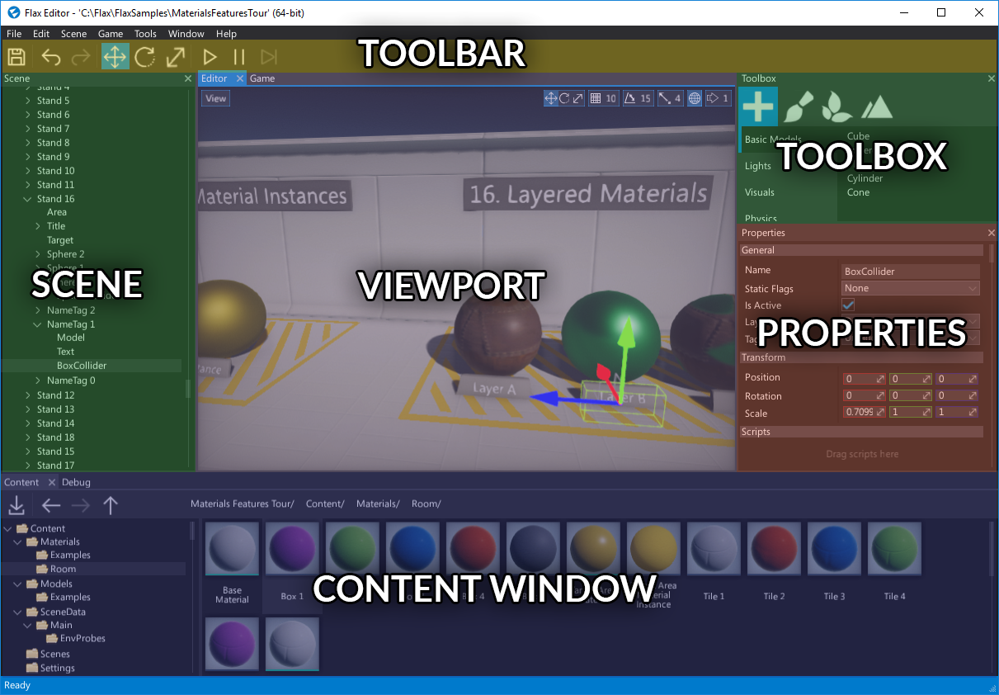
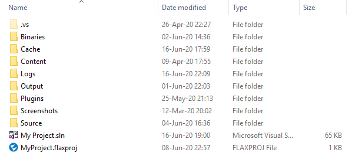

# Flax for Unity® developers


Flax and Unity have many similarities (C# scripting, physics engine) and share many concepts, however there are a few differences. This page helps Unity Engine developers to translate their existing Unity experience into the world of Flax Engine.

> [!Warning]
> Warning! Once you switch from Unity to Flax you will love this engine!

## Editor

Flax Editor and Unity Editor are very similar. You can see the color-coded, highlighted areas on screenshots of both editors that have common functionalities. Flax Editor layout is also highly customizable so you can drag and drop windows around to adapt the editor to your workflow.





> [!Tip]
> You don't have to pay or buy any *Pro* version to have a *Dark Theme* in the Flax Editor.

## Terminology

This section contains the most common terms used in Unity and their Flax equivalents (or rough equivalents). Flax keywords link directly to more in-depth information inside the documentation.

| Unity | Flax |
|--------|--------|
| **GameObject** | [Actor](../scenes/actors.md) |
| **MonoBehaviour** | [Script](../../scripting/index.md) |
| **Shader** | [Material](../../graphics/materials/index.md) |
| **Material** | [Material Instance](../../graphics/materials/instanced-materials/index.md) |
|||
| **Hierarchy Panel** | [Scene Window](../../editor/windows/scene-window.md) |
| **Inspector** | [Properties Window](../../editor/windows/properties-window.md) |
| **Project Browser** | [Content Window](../../editor/windows/content-window.md) |
| **Scene View** | [Viewport](../../editor/windows/viewport.md) |

## Project



Flax projects structure is similar to Unity projects. Instead of **Library** folder, editor uses **Cache** folder. Also **Assets** folder from Unity is splited into two separate parts: **Content** and **Source**. All C# script files are located in source directory so there is less mess with assets and scripts.

Flax also generates a solution and project files for your game C# scripts.

See [Flax projects structure](../project-structure.md) page to learn more about the projects in Flax Engine.

## Assets

Flax doesn't use `.meta` files. Instead of it, every asset contains all required metadata information and is a self contained file. Files with extension `.flax` are using our own binary format that is well optimized for scalability and streaming. Other assets are usually stored in json format (scenes, settings, etc.).

Flax supports the most popular asset files formats (for 3D models and textures) so you can import your game content.

See [Assets](../assets/index.md) page to learn more about importing and using game assets.

## GameObject vs Actor

Flax doesn't use components to build scene objects logic. We use [Actors](../scenes/actors.md). Each Actor has its own type (e.g. point light, box collider) and a collection of attached scripts. Also there is no *TransformComponent* but Actors have built-in transformation (less objects, more optimized design for bigger games). This means, in Flax the scene objects hierarchy is created with Actors, not by Transforms like in Unity.

However, you can still use the entity-component design with your scripts because every actor can have scripts like in Unity.
Just instead of using `GetComponent<T>()` in your scripts, write `GetChild<T>()`/`GetScript<T>()`.

In Flax, Scene object is also an Actor so you can access it like any other Actor. This means that Scenes can have their own scripts and be transformed like other objects.

## MonoBehaviour vs Script

When it comes to game scripting, Unity and Flax are very similar. The are some differences in C# API (Flax has bigger math library and uses new C# 7.2). In fact, the whole C# API is an open-source project and can be found [here](https://github.com/FlaxEngine/FlaxAPI). All contributions are welcome.

If you write C# scripts simply replace `MonoBehaviour` with `Script` as it makes more sense (and is shorter to write).

* Unity
```cs
public class MyScript : MonoBehaviour
{
	void Start()
	{
		Debug.Log("It is Unity!");
	}
}
```

* Flax
```cs
public class MyScript : Script
{
	public override void OnStart()
	{
		Debug.Log("It is Flax!");
	}
}
```

See [Scripting](../../scripting/index.md) documentation to learn more about C# scripts in Flax.

## Cool things in the C# API

If you're a programmer here is a list of new cool things in Flax C# API that may be useful:
* C# API and Editor are open-source ([link](https://github.com/FlaxEngine/FlaxAPI))
* You can edit all input settings at runtime ([link](https://github.com/FlaxEngine/FlaxAPI/blob/master/FlaxEngine/API/Static/Input.cs#L249))
* You can change the gamepad devices layout at runtime ([link](https://github.com/FlaxEngine/FlaxAPI/blob/master/FlaxEngine/Engine/Gamepad.cs#L203))
* You can dynamically set Update/Draw/Physics FPS ([link](https://github.com/FlaxEngine/FlaxAPI/blob/master/FlaxEngine/API/Static/Time.Gen.cs#L26))
* You can serialize/deserialize any objects to json ([link](https://github.com/FlaxEngine/FlaxAPI/blob/master/FlaxEngine/Json/JsonSerializer.cs#L226))
* You can use a huge math library ([link](https://github.com/FlaxEngine/FlaxAPI/tree/master/FlaxEngine/Math))
* You can perform custom rendering on GPU ([link](https://github.com/FlaxEngine/FlaxAPI/blob/master/FlaxEngine/Rendering/CustomRenderTask.cs))
* You can use Custom Editors pipeline to create great editor extensions ([link](https://github.com/FlaxEngine/FlaxAPI/tree/master/FlaxEditor/CustomEditors))

<hr>

Unity® is a trademark of Unity Technologies.
