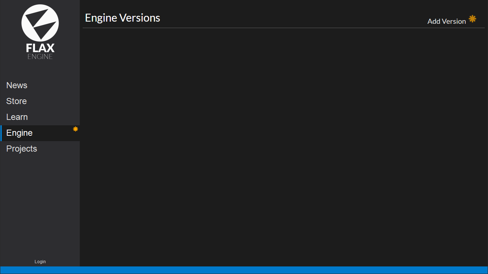
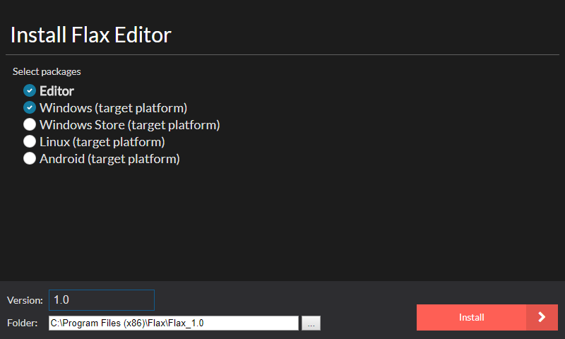

# Installing The Flax Launcher

To get Flax: Visit the [download page](http://flaxengine.com/download) to download the Flax Launcher installer.

After downloading the Flax Launcher, start the installer and follow the installation wizard steps. In order to install Flax you will be asked to accept the *EULA* that defines the engine licensing terms. You can learn more about legal regulations [here](http://flaxengine.com/licensing).

To learn more about the software and hardware requirements please visit [this page](requirements.md).

# Running The Flax Launcher

To install the Flax Engine: Run Flax (By default Flax creates a shortcut on the desktop.)
The next step is to **log in** to the Flax Launcher. 
> [!Note]
> This step is optional and can be skipped by clicking **Skip Login**.

# Installing The Flax Engine

After the login screen go to the **Engine** page. This is where you can download and manage engine installations. You can have multiple different versions of Flax installed on your computer. Here you can add new updates and download additional packages. 

To install Flax use the **Add Version** button to select the Engine version and target installation destination folder. Here is where you can pick a target platform to install the packages required to build and deploy your game for a given platform. Finally, you can press the **Install** button to download the Flax binaries.

By using *Version* dropdown menu you can pick the engine version to install. By default it selects the latest version but you can change it to get older engine version (eg. that your team is using). Also, it allows to download and use daily builds from Github master branch (named `master branch (daily)`). You will be able to download updates every day and enjoy frequent features and bug fixes.

> [!Note]
> The engine version with a blue outline is marked as default to open projects. Use the context menu on it (3 dots) to set another version as default or to modify it's properties.

Now you are ready to create great games and experiences. We can't wait to see what great things you're going to create with Flax! Start by creating your [project](create-a-project.md).

<h3><a href="create-a-project.md">Create a project</a></h3>

Create your very first Flax game project.

