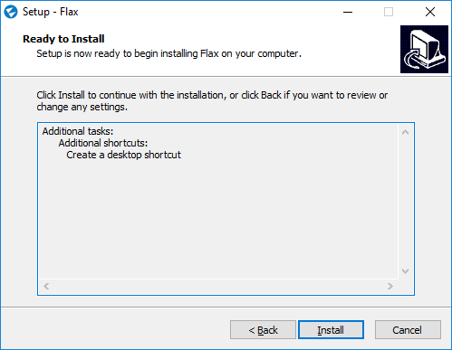
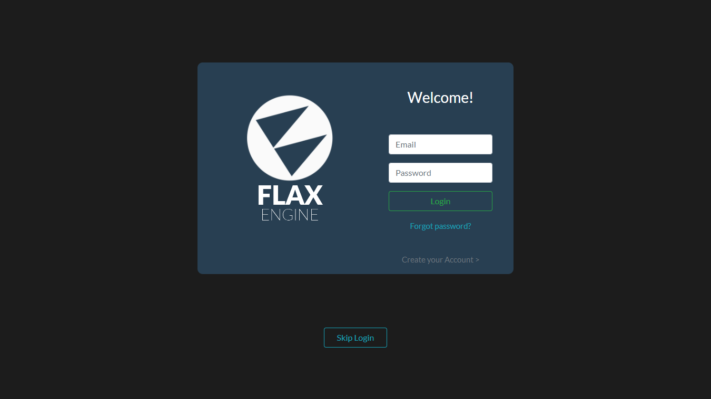
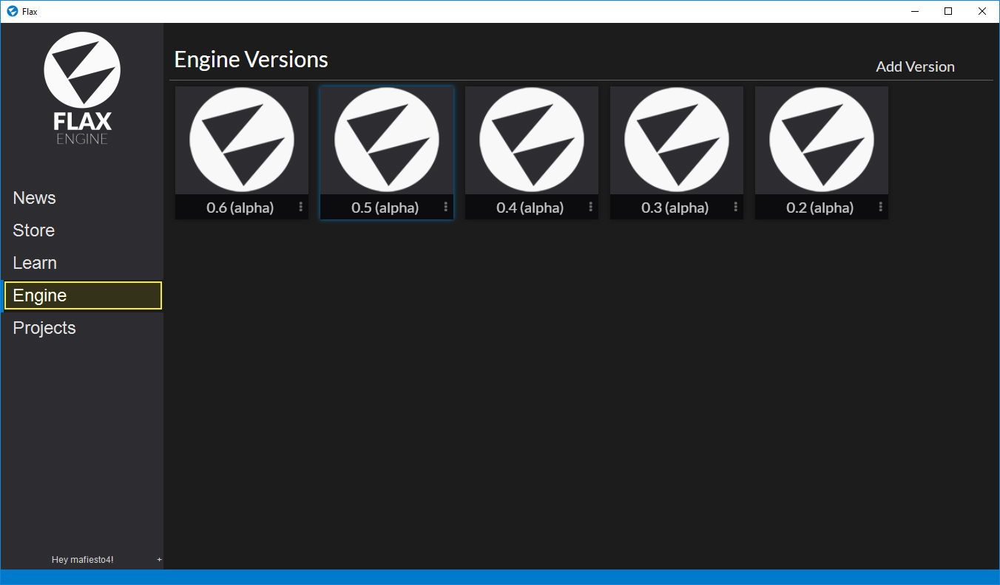
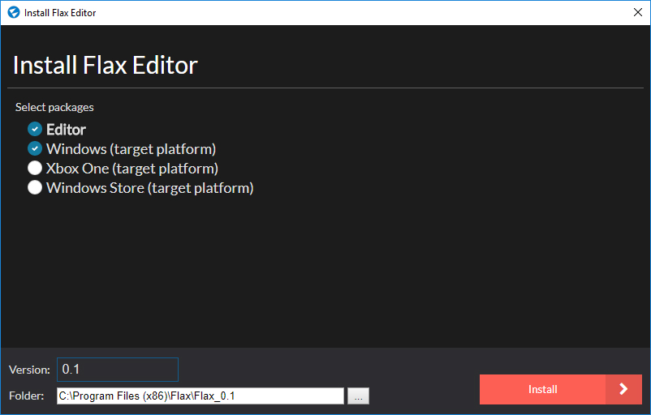
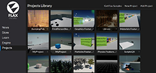

# Installing The Flax Launcher

To get Flax visit the [download page](http://flaxengine.com/download) and access the Flax Launcher applciation installer.

After downloading the Flax installer start the application and follow the installation wizard steps. In order to install Flax you will be asked to accept the *EULA* that defines the engine licensing terms. You can learn more about legal regulations [here](http://flaxengine.com/licensing).

To learn more about software and hardware requirements please visit [this page](requirements.md).

# Installing Flax Engine

Do you have a mouse? Yes? Ok, great. Now double click on **Flax** icon on your desktop.

The next step is to **log in** to the Flax Launcher. Simply use the same account credentials you used to access the installer. Your account is required to verify if you can download the engine builds from our digital distribution. The launcher supports *Offline mode* in case you want to create games without Internet access, far from civilization (far in the forest or on the sea).

After you log in go to the **Engine** page. It is used to download and manage engine installations. You can have multiple versions of Flax installed on your computer. Here you can add new updates and download additional packages. To install Flax click the **Add Version** button then select the version and a target installation destination folder. You can also pick a target platform to install if you want to build and deploy your game for a different platform. Finally, you can click the **Install** button and wait for just a second to download the Flax binaries.

> [!Note]
> The engine version with a blue outline is marked as default to open projects. Use the context menu on it (3 dots) to set another version as default or to modify its properties.

From now on you are ready to create great games and experiences. We can't wait to see what great things you gonna create with Flax! Start by creating your [project](create-a-project.md).

<h3><a href="create-a-project.md">Create a project</a></h3>

Create your very first Flax game project.

