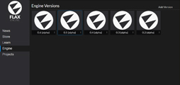
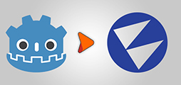
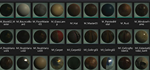
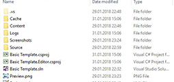
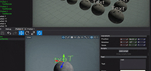

# Get started with Flax

Welcome to the official Flax Engine Manual! In this section you will find everything you need to start creating games with Flax from scratch. Let's get started!

## The first steps

<h3><a href="get-flax.md">Get Flax</a></h3>

Start using the Flax.

<h3><a href="create-a-project.md">Create a project</a></h3>

Create your very first Flax game project.

<h3><a href="../samples-tutorials/index.md">Samples and Tutorials</a></h3>

Collection of sample projects and tutorials.

## Migrate to Flax

<h3><a href="flax-for-ue4-devs/index.md">Flax for UE4® devs</a></h3>

Move your project and team from UE4 to Flax.

<h3><a href="flax-for-unity-devs/index.md">Flax for Unity® devs</a></h3>

Move your project and team from Unity to Flax.

<h3><a href="flax-for-godot-devs/index.md">Flax for Godot devs</a></h3>

Move your project and team from Godot to Flax.

## Learn the basics

<h3><a href="editor.md">Editor</a></h3>

Learn how to work with Flax Editor.

<h3><a href="scenes/index.md">Scenes</a></h3>

Create levels for your game.

<h3><a href="assets/index.md">Assets</a></h3>

Start creating content.

<h3><a href="project-structure.md">Project structure</a></h3>

Learn about Flax projects structure.

<h3><a href="prefabs/index.md">Prefabs</a></h3>

Learn how to create and use prefabs.

<h3><a href="vs-extension.md">Visual Studio extension</a></h3>

Install our plugin for Visual Studio for programmers.

<h3><a href="glossary.md">Glossary</a></h3>

See the most common terms used in Flax Engine.

