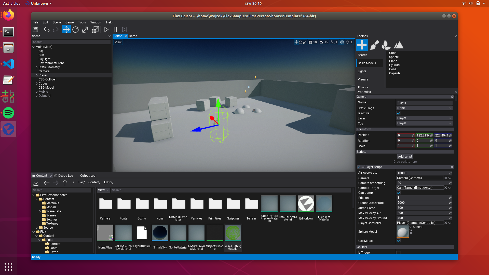

# Editor on Linux



## Download

You can get Flax from your [Download](https://flaxengine.com/download/) page, or compile it manually from the official [source code repository](https://github.com/FlaxEngine/FlaxEngine).

The Editor executable is located in folder `Binaries/Editor/Linux/Development/FlaxEditor` (you can use also Debug or Release configuration if you want).

## Requirements

For developers using Flax Editor on Linux platforms the requirements are:

| | Recommended |
|-------|-------|
| Tested operating systems | Ubuntu 23 or above |
| Processor | Quad-core or more, 2 GHz or faster |
| RAM | 4 GB or more |
| Hard drive space | 1 GB minimum |
| GPU | **Vulkan required** |

Flax Editor needs:

* `curl` lib on the system:

```
sudo apt-get install -y curl libcurl4-gnutls-dev
```

*  `.Net 8 SDK` ([https://dotnet.microsoft.com/en-us/download/dotnet/8.0](https://dotnet.microsoft.com/en-us/download/dotnet/8.0)).
```
sudo apt install dotnet-sdk-8.0
```

.Net version can be verified with:

```
dotnet --version
```

**Note:** On Fedora you might need additional fix for invalid lib linkage: 

```
sudo ln -s /usr/lib64/libcurl.so.4 /usr/lib64/libcurl-gnutls.so.4
```

## GPU Drivers

Please ensure to have the latest GPU drivers installed. Helper links:
- [NVIDIA drivers](http://www.nvidia.com/Download/index.aspx?lang=en-us/)
- [AMD drivers](http://support.amd.com/en-us/download)

For information about supported platforms, see [Platforms](../platforms/index.md).

## Command line access

If you're using laptop with integrated GPU, and you want Flax to run on dedicated GPU for more power, you can use command line switches to instruct engine to select a desire GPU based on the manufacturer:

| Option | Description |
|-------|-------|
| `-nvidia` | Selects Nvidia GPU. |
| `-amd` | Selects AMD GPU. |
| `-intel` | Selects Intel GPU. |

To learn more about command line switches see the [command line access page](../editor/advanced/command-line-access.md).

Example command line to run Editor with custom options:

```
./FlaxEditor -project "<project-path>" -std -nvidia
```

## Run the Editor

The Editor is located in `Binaries/Editor/Linux/Development/FlaxEditor`.

To run the editor, Flax needs to know the path of the folder that contains the project files:

```
./FlaxEditor -project <"project-path">
``` 

In case you don't specify a project path, a windows will appear asking you to indicate where the `flax-proj` file is located.


```
./FlaxEditor
``` 

You can start by using a Sample project or creating a new project.

## Sample projects

To help you start using Flax pick the latest Flax Samples from [https://github.com/FlaxEngine/FlaxSamples](https://github.com/FlaxEngine/FlaxSamples). This collection contains various example projects that showcase the engine features and can be used as a foundation for your future Flax projects. Have fun!


## New project

To create a new project, first you need to create a new folder that will contain the project files. Then, run Flax Editor executable as follows:

```
./FlaxEditor -new -project <"new_project_path">
``` 
This will create a new project inside the specified folder. The Editor will generate a project template and open it.

From here, you'll probably want to know how to [create a Scene](https://docs.flaxengine.com/manual/get-started/scenes/index.html) , or take the first steps on the [Flax Editor](https://docs.flaxengine.com/manual/get-started/editor.html).


**Note:** When creating a new project, if the Editor informs that a *script compilation failure* has ocurred, is because `Flax.Build` file needs to be set as an executable. In folder `Binaries/Tools` right-click on the file, select "Properties", and check the box that says "Allow executing file as program". Or use the command line: 

```
chmod a+x Flax.Build
```
