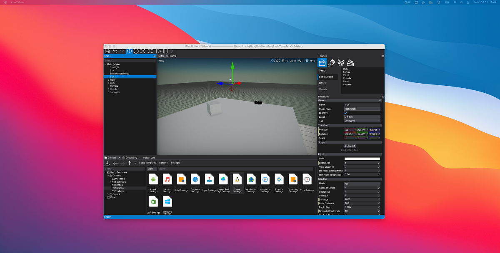

# Editor on Mac

## Download

Use the latest [Continuous Deployment](https://github.com/FlaxEngine/FlaxEngine/actions/workflows/cd.yml) build from Github Actions by downloading and extracting `Mac-Editor` package (**Artifacts** section). 

> [!TIP]
> We're planning to add officially signed `.dmg` packages distribution with Editor soon.

The Editor executable is in folder `Binaries/Editor/Mac/Development/FlaxEditor` (you can use also Debug or Release configuration if you want).

Also, you can compile it manually from the official [source code repository](https://github.com/FlaxEngine/FlaxEngine) (follow instructions from readme file).

## Requirements

For developers using Flax Editor on Mac platforms the requirements are:

| | Recommended |
|-------|-------|-------|
| Minimum supported version | **macOS 10.14 or higher** |
| Processor | Quad-core or more, 2 GHz or faster |
| RAM | 4 GB or more |
| Hard drive space | 1 GB minimum |

## Command line access

You can specify the C# Mono debugger port eg. `-debug 127.0.0.1:55555`. To learn more about command line switches see [this documentation page](../editor/advanced/command-line-access.md).

## New project

To create a new project to run Flax Editor executable as follows `./FlaxEditor -new -project <new_project_path>` to create a new project inside a specified folder. Editor will generate a project template and open it.

## Sample projects

To help you start using Flax pick the latest Flax Samples from [https://github.com/FlaxEngine/FlaxSamples](https://github.com/FlaxEngine/FlaxSamples). This collection contains various example projects that showcase the engine features and can be used as a foundation for your future Flax projects. Have fun!
