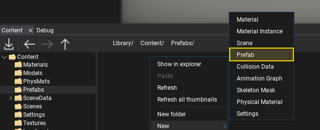
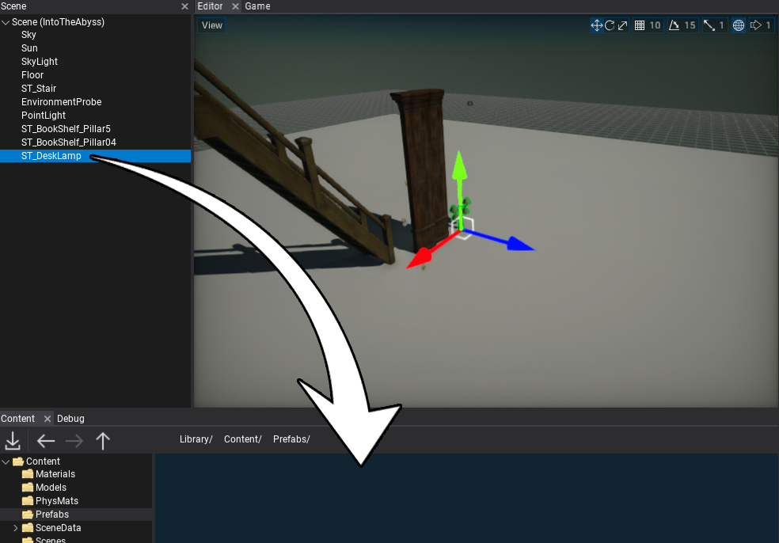

# HOWTO: Create prefab

In this tutorial, you will learn how to create a new prefab asset. Follow the instructions to see how to do it. In Flax, there are 3 main ways to create a prefab asset. Use the one that fits your workflow the most.

## New Prefab

The easiest option to create an empty prefab is by using *Content Window*. **Right-click** and choose option **New -> Prefab**. Then double-click and edit your new asset.



## Drag and Drop

Another way to create a new prefab asset is by using the existing actors as an archetype. To do it simply select the actor on a scene that you want to turn into a prefab and drag it into the *Content Window*. Specify its name and hit enter to confirm. Then double-click and edit your new asset.



## From code

The last way to create a new prefab is by using an editor script that creates a new prefab asset using C# or C++.

### C#

```cs
// Setup prefab objects
var myLight = new PointLight
{
    Color = Color.Red
};

new Decal
{
    Parent = myLight
};

// Create a prefab
PrefabManager.CreatePrefab(myLight, StringUtils.CombinePaths(Globals.ProjectContentFolder, "myPrefab.prefab"), false);
```

### C++

```cpp
// Setup prefab objects
PointLight* myLight = New<PointLight>();
myLight->SetName(TEXT("PointLight"));
myLight->Color = Color::Red;

Decal* myDecal = New<Decal>();
myDecal->SetName(TEXT("Decal"));
myDecal->SetParent(myLight);

// Create a prefab
PrefabManager::CreatePrefab(myLight, Globals::ProjectContentFolder / TEXT("myPrefab.prefab"), false);
```