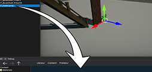
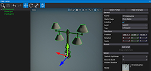
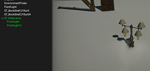
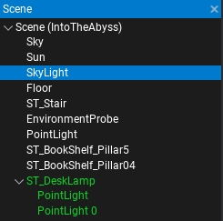
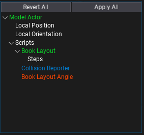

# Prefabs

A **Prefab** is an asset that contains serialized **actors hierarchy, including scripts and data**. The prefab acts like a template or an archetype which you can spawn in the scene. Any edits made to a prefab asset are immediately reflected in all instances produced from it, but you can also override components and settings for each instance individually.

Flax supports creating **Nested Prefabs** which means you can use objects from prefabs inside other prefabs. This helps with creating advanced gameplay content.

Creating and applying changes to prefabs is only supported in the Editor. However, spawning prefabs can be done at game runtime, and can be done using game scripts. Use this documentation section to learn more about creating and using prefabs.

## Topics

<h3><a href="creating-prefabs.md">Creating prefabs</a></h3>

Learn how to create a new prefab asset.

<h3><a href="prefab-editor.md">Prefab Editor</a></h3>

Learn how to open and edit prefab assets.

<h3><a href="spawning-prefabs.md">Spawning prefabs</a></h3>

Learn how to add prefab objects to your game.

## Prefabs in Editor

Spawned prefabs are called **prefab instances** and contain a link to the prefab asset and the reference object from the prefab. The Editor highlights the prefab instances in the *Scene Window* as shown in the picture below.

After selecting a prefab instance the *Properties Window* shows two additional buttons on top of the panel: **Select Prefab** and **View Changes**.

The **Select Prefab** button shows the linked prefab asset location in the *Content Window* and selects it.

The **View Changes** button shows a popup with any modified actor and scripts properties compared to the prefab. It is used to see all the changes applied to the prefab instance and allows them to be reverted or applied to the prefab. The picture below shows the content of a sample prefab changes popup. You can right click on the modified tree nodes to revert the per-property change while keeping other modification unchanged.

You can also see per-property modifications applied to the prefab instance. The Editor shows them by highlighting the label of the changed property as shown in the picture below. You can right click on it and revert the changes applied to this property (with undo support).

