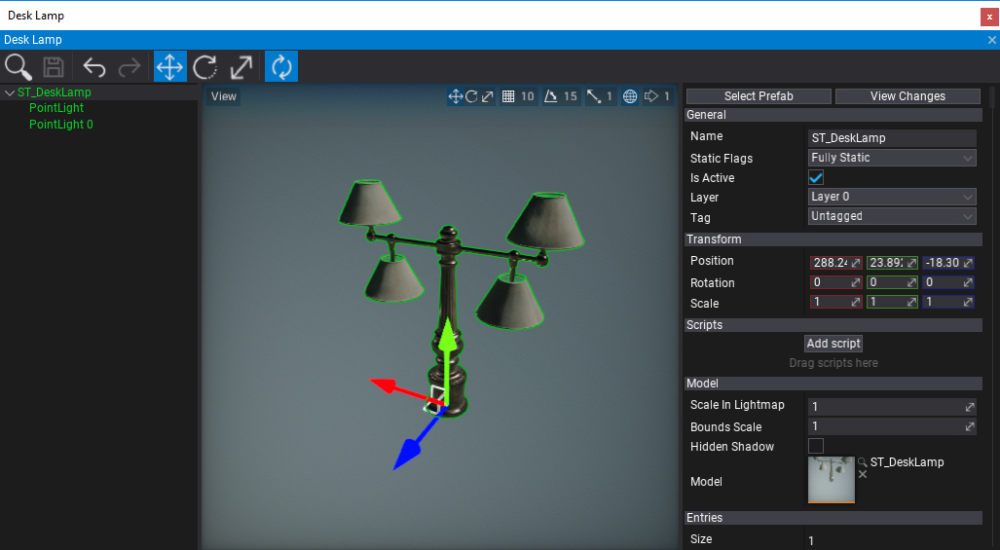
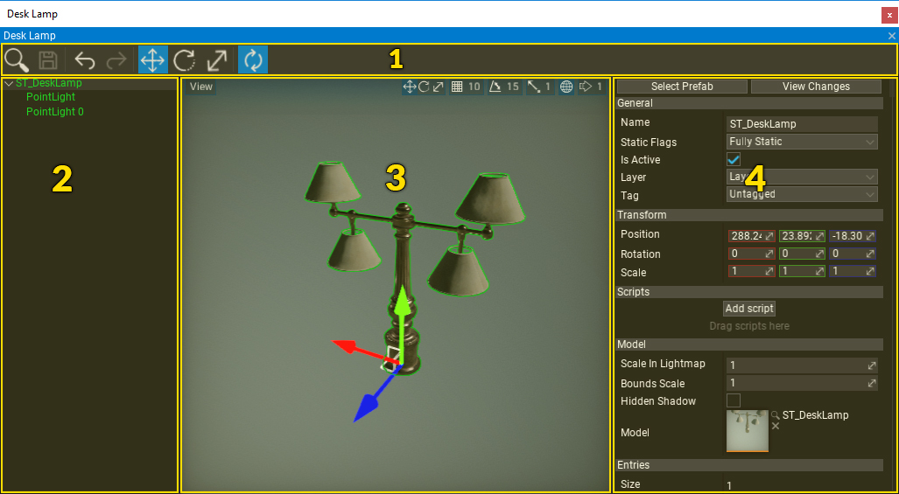

# Prefab Editor

The **Prefab Editor Window** is the main tool to preview and edit prefab assets. To show it simply double-click on a prefab in a *Content Window*. Saving the modified prefab asset synchronizes the changes with the existing instances of the prefab in the scene including all prefabs using this prefab as a nested prefab.

## Introduction

The Prefab Editor works like the Scene Editor combined with Scene Tree Window and Properties Window that are in-built in the Flax Editor, except the Prefab Editor shows and edits only the given prefab asset.

> [!Note]
> You can use widget **View -> Show Default Scene** to hide the default sky, directional light, and environment probe used as a default preview scene background.

The Prefab Editor Window supports full undo so any of your actions can be reverted. You can also open and edit more than one prefab at once.

## Live Reload

**Live Reload** is a feature that performs auto-synchronization of the edited prefab modifications live. Updating prefab instances is very fast so the live reload can be performed very often when you edit the prefab asset. It is enabled by default but can be disabled by using the dedicated tool strip button.

In Live Reload mode all changes are synchronized live without pressing the *Save* button. It makes editing easier and helps with rapid development.

## Interface

The prefab window UI consists of a toolstrip, hierarchy panel, viewport, and properties panel.

1. Toolstrip
2. Hierarchy Panel
3. Viewport
4. Properties Panel

### Toolstrip

The following table lists the options in the toolstrip and what they do.

| Icon                                            | Description                                                                  |
| ----------------------------------------------- | ---------------------------------------------------------------------------- |
|  | Shows and selects the asset in the *Content Window*.                         |
|  | Saves the prefab to a file and updates the existing prefab instances.        |
|  | Reverts the last scene modification action (Ctrl+Z).                         |
|  | Replays the last scene modification action (Ctrl+Y).                         |
|  | Changes Gizmo tool mode to *Translate* (1).                                  |
|  | Changes Gizmo tool mode to *Rotate* (2)                                      |
|  | Changes Gizmo tool mode to *Scale* (3)                                       |
|  | Live changes preview (applies prefab changes on modification automatically). |

### Hierarchy Panel

The Hierarchy Panel shows a tree control with the full hierarchy of the prefab objects. Use it to add, remove or move actors. It works similarly to the editor [Scene Window](../../editor/windows/scene-window.md).

Every Actor is represented by a tree node (named after the actor). You can expand and collapse the scene hierarchy by using the arrow icons on the left of the node names. To select one or more nodes use LMB, Ctrl + LMB or Shift + LMB to select range of nodes.

If you select and drag the actor or selection of actors you can reorder or reparent them.

### Viewport

The viewport panel shows the preview of the prefab. You can navigate in the viewport by using the **RMB + Arrows/WSAD**. It works similarly to the [Scene Window](../../editor/windows/viewport.md). Use the **LMB** to select the objects.

The upper left and upper right corners of the viewport contain widget buttons. Use them to adjust the view and configure the tool.

### Properties panel

This panel shows the properties of the selected objects. If you select any object from the prefab you will be able to modify its properties using this panel. It supports full undo/redo actions and uses the Custom Editors pipeline to generate the UI.
