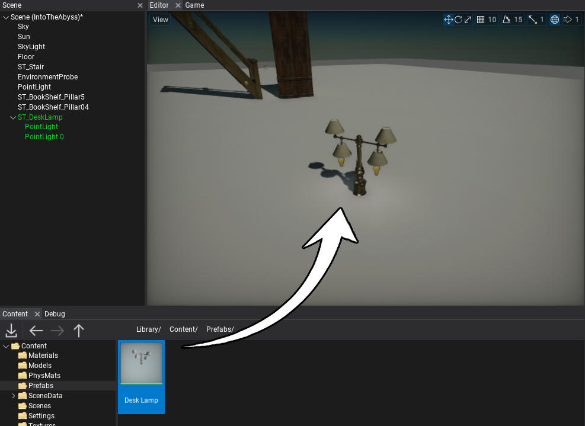

# HOWTO: Spawn prefab

In this tutorial, you will learn how to spawn a prefab in your game. Follow the instructions to see how to do it. In Flax, there are 2 main ways to create a prefab instance. Use the one that fits your workflow the most.

## Drag and Drop

The easiest way to create a new prefab object instance is by dragging the asset from the *Content Window* into the Scene Editor window or Scene Tree window. Spawned object(s) will be linked to the prefab asset.



## From code

Another way to create a new prefab object instance is by using a spawning method from the Flax C# or C++ API. You can spawn a prefab to the scene and specify its transform or a parent actor. The following script spawns a prefab.

# [C#](#tab/code-csharp)
```cs
PrefabManager.SpawnPrefab(myPrefab, new Vector3(0, 10, 0));
```
# [C++](#tab/code-cpp)
```cpp
#include "Engine/Level/Prefabs/PrefabManager.h"

PrefabManager::SpawnPrefab(myPrefab, Vector3(0, 10, 0));
```
***
