# Actors

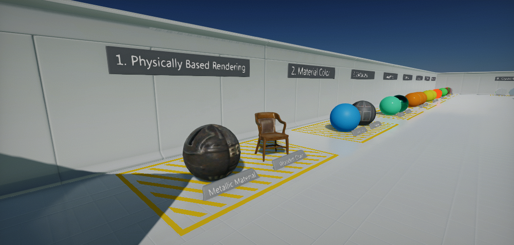

**Actors** are the essential objects of the scenes. You can place them into a level to build game environment, setup a lighting and create a gameplay. Every [Actor](https://docs.flaxengine.com/api/FlaxEngine.Actor.html) is linked to the parent actor (except the Scene actors which are root of the hierarchy) and can have child actors (tree hierarchy). Actors have own 3D transformation (translation, rotation and scale) and inherit the parent actor transformation. You can attach C# scripts to the actors and spawn/destroy them at runtime.

This documentation page contains link to all tutorials related to working with actors and references to all actor types.

## Using actors

<a href="placing-actors.md">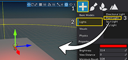</a>
<h3><a href="placing-actors.md">Placing actors</a></h3>

Learn how to create and remove actors in editor.

<a href="selecting-actors.md">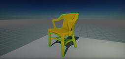</a>
<h3><a href="selecting-actors.md">Selecting actors</a></h3>

Learn how to select actors in editor.

<a href="transforming-actors.md">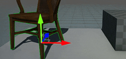</a>
<h3><a href="transforming-actors.md">Transforming actors</a></h3>

Learn how to move, rotate and scale your objects in editor.

## Actor types

<a href="../../graphics/cameras/index.md">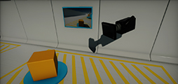</a>
<h3><a href="../../graphics/cameras/index.md">Camera</a></h3>

<h3><a href="../../graphics/lighting/reflections/env-probe.md">Environment Probe</a></h3>

<a href="../../graphics/models/model-actor.md">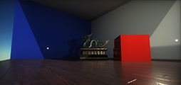</a>
<h3><a href="../../graphics/models/model-actor.md">Model Actor</a></h3>

<a href="../../graphics/lighting/light-types/directional-light.md">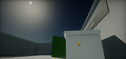</a>
<h3><a href="../../graphics/lighting/light-types/directional-light.md">Directional Light</a></h3>

<a href="../../graphics/lighting/light-types/point-light.md">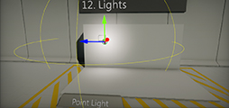</a>
<h3><a href="../../graphics/lighting/light-types/point-light.md">Point Light</a></h3>

<a href="../../graphics/lighting/light-types/spot-light.md">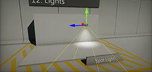</a>
<h3><a href="../../graphics/lighting/light-types/spot-light.md">Spot Light</a></h3>

<a href="../../graphics/lighting/light-types/sky-light.md">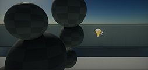</a>
<h3><a href="../../graphics/lighting/light-types/sky-light.md">Sky Light</a></h3>

<h3><a href="../../graphics/lighting/sky-skybox/sky.md">Sky</a></h3>

<a href="../../graphics/lighting/sky-skybox/skybox.md">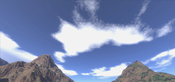</a>
<h3><a href="../../graphics/lighting/sky-skybox/skybox.md">Skybox</a></h3>

<a href="../../graphics/post-effects/post-fx-volumes.md">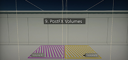</a>
<h3><a href="../../graphics/post-effects/post-fx-volumes.md">PostFx Volume</a></h3>

<a href="index.md">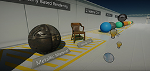</a>
<h3><a href="index.md">Scene</a></h3>

<h3><a href="../../physics/rigid-bodies.md">Rigid Body</a></h3>

<h3><a href="../../physics/character-controller.md">Character Controller</a></h3>

<a href="../../physics/colliders/index.md">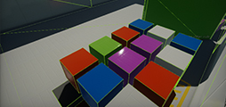</a>
<h3><a href="../../physics/colliders/index.md">Colliders</a></h3>

<a href="../../physics/joints/index.md">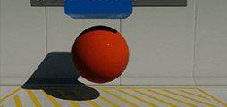</a>
<h3><a href="../../physics/joints/index.md">Joints</a></h3>

