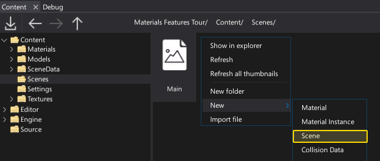
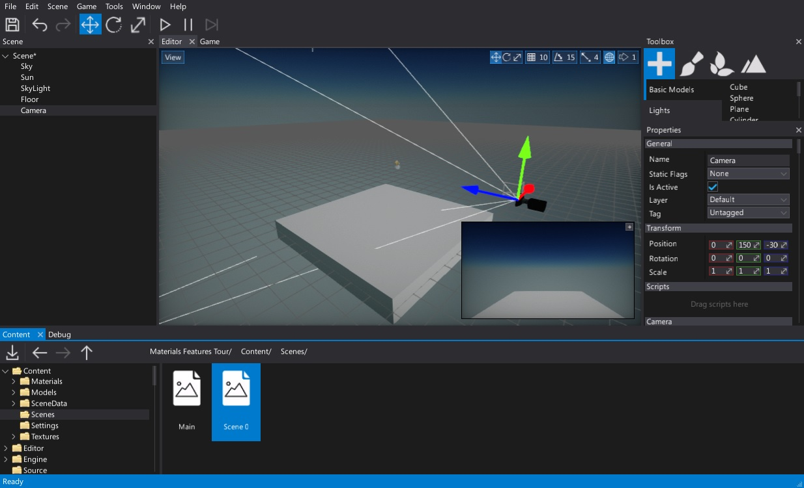
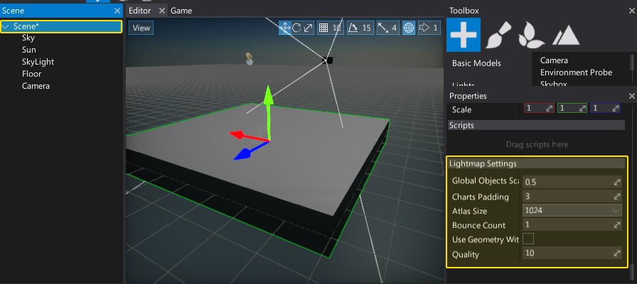

# Scenes

**Scenes** are levels of your game that are composed of [Actors](actors.md). A single scene is an asset stored in a *json* format and contains serialized scene objects attached to it (actors, scripts, etc.).

Flax supports dynamically loading and unloading multiple scenes. You can open and edit many scenes in the editor at the same time.

## Create a scene

You can create scenes like any other asset. Use the *Content* window. Right-click and choose option **New -> Scene**. Then, specify its name and hit *Enter* to confirm.

## Open a scene

To open a scene, simply double-click on it. You can also drag and drop it to the editor viewport to load it additively (this won't unload the existing scene(s)).

## Properties

You can select a **Scene** actor like other scene objects using the *Scene* window and edit its properties with the *Properties* window. You can change static flags for all scene objects at once or transform whole scene at once.  
The scene actor properties view also contains options for lightmap baking for the selected scene.

## In this section

* [Actors](actors.md)
* [World Units](world-units.md)
* [Scene Data Storage](scene-data.md)
