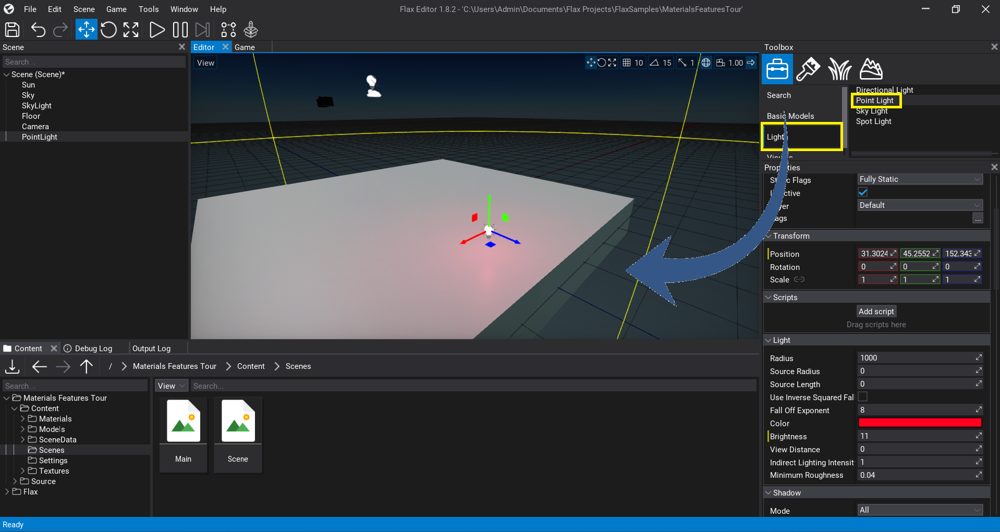

# Placing Actors

After you create a scene, you need to add actors to it and build your game level. There are various methods to create new objects.

## Placing actors using a Toolbox


The easiest method to add a new actor is to use a *Toolbox* window in *Add Mode* active.
Simply select the actor type category and drag and drop it into your scene.



## Placing actors using a Context Menu

You can also add new actors using a Context Menu in a *Scene* window. Right-click on scene or other actor, select submenu **New** and spawn one of the actor types.


## Placing actors using Drag and Drop

The fastest way to add new model into the level is by using *drag and drop* feature. In that way you can add models, prefabs, mesh colliders and even scenes.


## Placing actors from code

You can also spawn new actors from C# code. To learn more about it see [Scripting](../../scripting/index.md) documentation.

```cs
var light = new PointLight();
light.Color = Color.Blue;
light.Parent = Actor;
```

## Next step

<div class="frontpage">

<div class="frontpage-section">
<a href="selecting-actors.md"></a>
<h3><a href="selecting-actors.md">Selecting actors</a></h3>
<p>Learn how to select actors in editor.</p>
</div>

</div>
