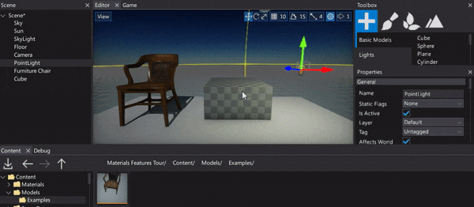

# Selecting Actors

Selecting actors in your scene is one of the most essential parts of the level design. There are different ways to select objects. Each of these is detailed below.

## Pick selection

To select an object simply click **left mouse button** on it in a *Editor* window. Clicking on an actor will deselect any currently selected actors and select the new one instead. If you hold down the **Ctrl** key while you click on a new (unselected) object, the new object is added to the selection. If you hold down the **Ctrl** key while clicking on an already selected object, the object is removed from the selection.

## Scene tree selection

You can also use a *Scene* window that shows the hierarchy of the scene with a tree view control. Each node represents an actor so you can **left-click** to select it. If you press the **Ctrl** key while selecting you will add or remove the actor from the selection. Additionaly if you hold **Shift** key you will select range of actors at once.

## Next step

<h3><a href="transforming-actors.md">Transforming actors</a></h3>

Learn how to move, rotate and scale your objects in editor.

