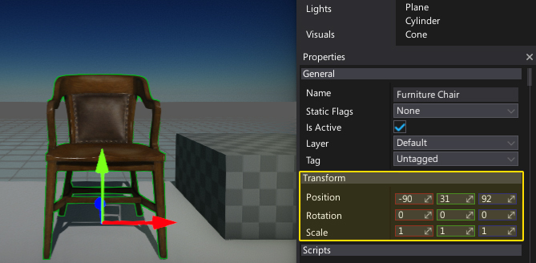
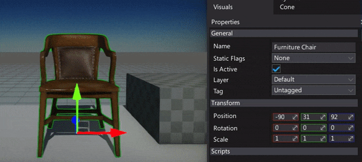
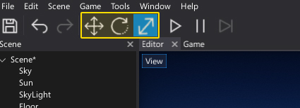
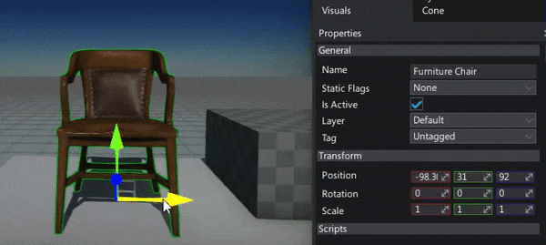
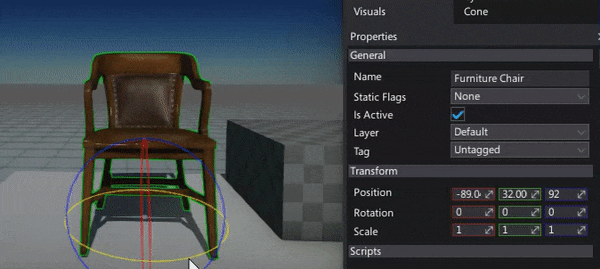
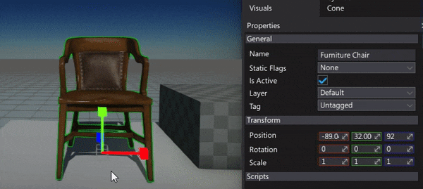
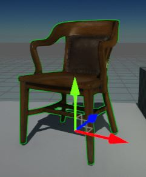
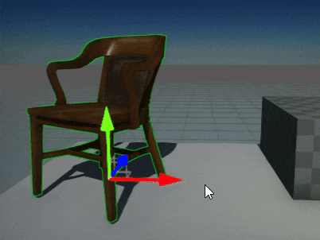

# Transforming Actors

To setup your scenes you need to move, rotate and scale actors. There are two major ways to transform actors in the editor.

## Transform property

If you select one or more actors you can modify their properties in a *Properties* window. This includes editing **local transformation**.

You can also use sliders near the transform properties to edit an object more quickly.

## Transform gizmos

The most common way to transform objects is by using transform/rotate/scale gizmos.
Using these widgets is convenient as it allows you to manipulate the objects in the editor window with your mouse.  
  
To change the transform gizmo widget mode use keys **1**, **2** and **3** or the toolbar buttons:

The Editor viewport shows a set of buttons and options in the upper right corner.
You can use them to adjust the gizmo settings.

### Translation gizmo

The **Translation** gizmo moves selected objects along a particular axis (or plane).
To use it, click on an axis (red, green or blue) and drag it.  
You can also move objects along a plane by using the squares between the axis arrows.

### Rotation gizmo

The **Rotation** gizmo rotates selected objects along a particular axis.
To use it click on an axis circle (red, green or blue) and drag it.

### Scale gizmo

The **Scale** gizmo scales selected objects along a particular axis.
To use it click on an axis (red, green or blue) and drag it.
You can also uniform scale objects by using a gray box in the center of the gizmo.

## World and Local transformation space

The Transformation gizmo can transform objects in two modes: world and local. In world mode, the gizmo is aligned to the world coordinates (left-handed unit X, Y and Z). In local mode, the gizmo is aligned to the object transformation frame.  
  
You can toggle the active transformation space of a gizmo:

| World | Local |
|--------|--------|
|  |  |

## Snapping

You can **snap** transformations to the grid. This means that the degree of transformation you apply to actors is rounded to the closest multiple of the number you specify. For example, if you set the rotation snap value to 10, actors rotate in multiples of 10 (0, 10, 20, 30, etc).

When you transform objects hold the **Ctrl** key to snap the values.
Snapping can be configured using a widget button:

## Duplicate the actor

You can duplicate selected objects with a transform gizmo if you hold the **Shift** key and start transforming objects.

