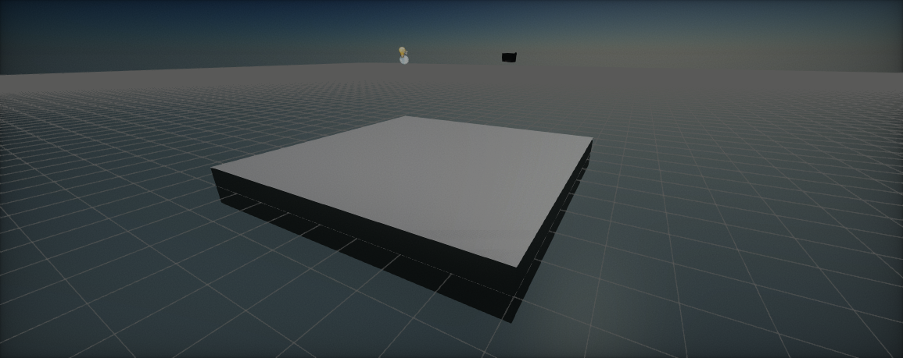

# World Units

Flax uses **centimeters** as a unit of length and **kilograms** as a unit of weight.
These world units are used by the physics and rendering engines.
You should stick to using realistic values in order to create solid visual and physical behaviour of the objects.

## Coordinate system

Flax uses **left-handed** coordinate system. Where each axis points:
* **X** axis - *right* direction
* **Y** axis - *up* direction
* **Z** axis - *forward* direction

## Math library

Flax uses **row-major matrices** and row vectors.
Hovewer Flax tries to use [Transform](https://docs.flaxengine.com/api/FlaxEngine.Transform.html) structure as much as possible when it comes to objects trasformation representation as it is easier to work with and has better precision in some cases. Transformation order is always: **Scale** -> **Rotate** -> **Translate** (TRS style).

