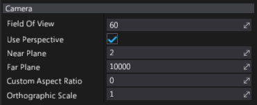
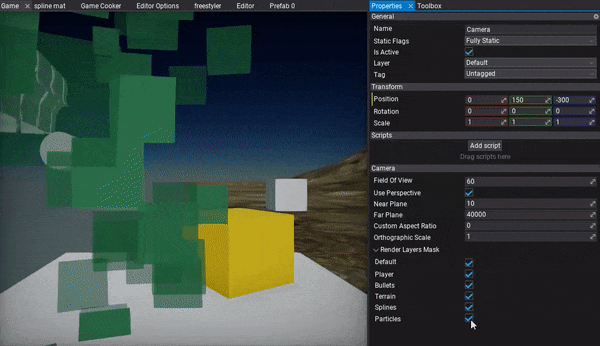
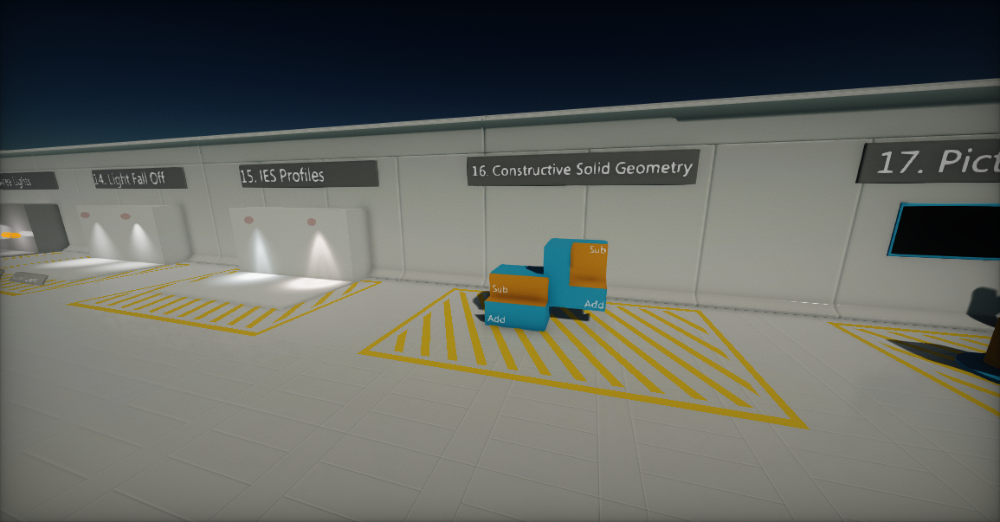
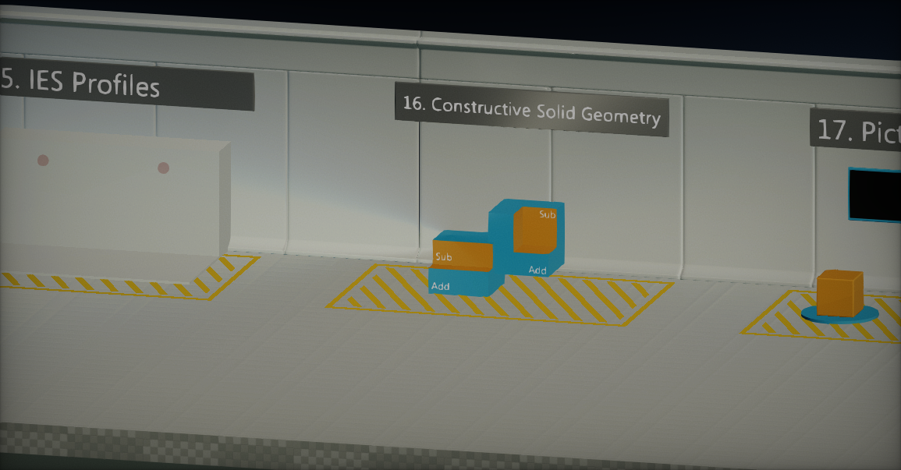

# Cameras


**Camera** captures the scene and displays it to the user. It defines a view in screen space. A camera's position and rotation define the *viewport* and *view direction*. Those properties are used to render scene objects and present them to the user.

## Changing the active camera

Flax Engine allows to create an unlimited amount of cameras in scenes while the [main one](http://docs.flaxengine.com/api/FlaxEngine.Camera.html#FlaxEngine_Camera_MainCamera) is used for the final frame rendering.

To change the camera used for rendering, you can use the following code, where `MyCamera` is the camera you want to change to:

```cs
Camera.OverrideMainCamera = MyCamera;
```

## Creating a camera in the editor

In the *Scene* tree window, right-click and select **New -> Camera**.
The Editor will create new Camera actor with default properties.


## Creating a camera in script

The following sample code can be used to instantiate a new camera object in a scene.

```cs
public class MyScript : Script
{
	public override void OnStart()
	{
		var camera = new Camera();
		Level.SpawnActor(camera);
		camera.Position = new Vector3(0, 100, 0);
	}
}
```

To learn more about the C# scripting API see the [Camera](http://docs.flaxengine.com/api/FlaxEngine.Camera.html) class.

## Camera properties



| Property | Description |
|--------|--------|
| **Use Perspective** | If checked, camera will use perspective projection, otherwise orthographic. |
| **Field Of View** | The vertical field of view (in degrees) used for perspective projection. |
| **Near Plane** | The nearest point the camera can see (near clipping plane). |
| **Far Plane** | The furthest point the camera can see (far clipping plane). |
| **Custom Aspect Ratio** | Custom aspect ratio you specify. Otherwise, automatically adjust the aspect ratio to the render target ratio. Use value 0 to disable it. |
| **Orthographic Size** | *Only visible when **Use Perspective** is false.* The orthographic projection view height (width is based on the aspect ratio). Use `0` for size to be based on the viewport size. |
| **Orthographic Scale** | *Only visible when **Use Perspective** is false.* Additional scale used for the orthographic projection size. This has the effect of zooming in and out. |
| **Render Layers Mask** | The layers mask used for rendering using this camera. Can be used to include or exclude specific actor layers from the drawing. |
| **Render Flags** | Frame rendering flags used to switch between graphics features for this camera. See [ViewFlags](https://docs.flaxengine.com/api/FlaxEngine.ViewFlags.html) api reference. |
| **Render Mode** | Describes frame rendering modes for this camera. See [ViewMode](https://docs.flaxengine.com/api/FlaxEngine.ViewMode.html). |

## Masking object layers



Every actor on a scene has a **Layer** property assigned. Cameras can use per-layer masking for rendering to include or exclude certain objects from being drawn.

## Perspective and orthographic cameras

Camera objects can work in two modes: perspective and orthographic. Each mode uses a different projection mapping method to affect how the rendered scene looks.

- The **Perspective** camera provides a "real-world" perspective of the objects in your scene. In this view, objects close to the camera appear larger, and lines of identical lengths appear different due to foreshortening, as in reality. Perspective cameras are most used for games that require a realistic perspective, such as third-person and first-person shooters.

- The **Orthographic** camera always renders objects in the same size, no matter their distance from the camera. Parallel lines never touch, and there's no vanishing point. Orthographic cameras are most used for games with isometric perspectives, such as some strategy or role-playing games.

## Field of view (perspective mode only)

If a camera has the **Use Perspective** value checked, then it will use perspective projection. The **field of view** changes the camera's frustum, and has the effect of zooming in or out of the scene. When using a high value (90 or above), the field of view results in stretched "fish-eye lens' views.

| Field of view: 50 | Field of view: 80 |
|--------|--------|
|  |  |

## Orthographic scale (orthographic mode only)

If a camera has the **Use Perspective** value unchecked, then it will use orthographic projection. The **orthographic scale** changes the camera frustum size, and has the effect of zooming in or out of the scene.

To have more precise over projection use **Orthographic Size** property that defines the exact size (if not set to `0` which uses viewport size).

| Orthographic scale: 0.3 | Orthographic scale: 1 |
|--------|--------|
|  |  |

## Near and far planes

The near and far clipping planes are used to define the camera frustum begin and end points.
The near plane is the closest point the camera can see. All geometry that is in front of it won't be rendered.
The far plane is the furthest point the camera can see. It's also known as a draw distance or a view distance. All geometry that is beyond it won't be rendered.

Adjusting the near and far planes affect rendering precision and scene depth quality. Using too small of a near plane value (lower than 1) or a very high far plane (higher than 100000) may result in depth precision issues as well as [Z-fighting](https://en.wikipedia.org/wiki/Z-fighting).

| Near plane: 300 | Far plane: 800 |
|--------|--------|
|  |  |

## Render a camera to a texture

Flax Engine offers a very wide range of customization that can be made to extend the rendering pipeline. One of them is rendering a scene using the custom camera right to the render target, then presenting it on an object surface. To create such an effect check out the tutorial: [How to render a camera to a texture](render-camera-to-texture.md).

## Alpha output

The renderer supports including an alpha channel in the output image. It might be required for games that want to composite draw output over other images (eg. a minimap or a game character preview over the game UI). It can be enabled per-SceneRenderTask by setting the `UseAlpha` property on the render buffers used by that task:

```cs
MainRenderTask.Instance.Buffers.UseAlpha = true;
```

Then, the renderer will use `R16G16B16A16` format for the image textures and passthrough the alpha channel. This affects game performance, as the default `R11G11B10` format is more optimized for lower memory bandwidth. When using alpha in output try to disable unused PostFx features to reduce memory pressure and improve performance.

## Override view

Flax uses an extensible RenderTask system for high-level rendering architecture. By default a game uses the `MainRenderTask.Instance` to drive the scene rendering into the main game viewport. You can use it to plug into the rendering pipeline for custom effects, rendering or view override.

# [C#](#tab/code-csharp)
```cs
class MyScript : Script
{
    public override void OnEnable()
    {
        MainRenderTask.Instance.PreRender += OnPreRender;
    }

    public override void OnDisable()
    {
        MainRenderTask.Instance.PreRender -= OnPreRender;
    }

    private void OnPreRender(GPUContext context, ref RenderContext renderContext)
    {
        // Here you can modify the render View
        float fov = 120.0f;
        renderContext.View.Near = 100.0f;
        Viewport viewport = renderContext.Buffers.Viewport;
        Matrix view = renderContext.View.View;
        Matrix proj;
        Matrix.PerspectiveFov(fov * Mathf.DegreesToRadians, viewport.AspectRatio, renderContext.View.Near, renderContext.View.Far, out proj);
        renderContext.View.SetUp(ref view, ref proj);
    }
}
```
# [C++](#tab/code-cpp)
```cpp
#pragma once

#include "Engine/Scripting/Script.h"
#include "Engine/Core/Log.h"
#include "Engine/Graphics/RenderBuffers.h"
#include "Engine/Graphics/RenderTask.h"

API_CLASS() class GAME_API MyScript : public Script
{
    API_AUTO_SERIALIZATION();
    DECLARE_SCRIPTING_TYPE(MyScript);

    void OnPreRender(GPUContext* context, RenderContext& renderContext)
    {
        // Here you can modify the render View
        float fov = 120.0f;
        renderContext.View.Near = 100.0f;
        const Viewport viewport(renderContext.Buffers->GetViewport());
        Matrix view = renderContext.View.View;
        Matrix proj;
        Matrix::PerspectiveFov(fov * DegreesToRadians, viewport.GetAspectRatio(), renderContext.View.Near, renderContext.View.Far, proj);
        renderContext.View.SetUp(view, proj);
    }

    // [Script]
    void OnEnable() override
    {
        MainRenderTask::Instance->PreRender.Bind<MyScript, &MyScript::OnPreRender>(this);
    }

    void OnDisable() override
    {
        MainRenderTask::Instance->PreRender.Unbind<MyScript, &MyScript::OnPreRender>(this);
    }
};

inline MyScript::MyScript(const SpawnParams& params)
    : Script(params)
{
}
```
***
