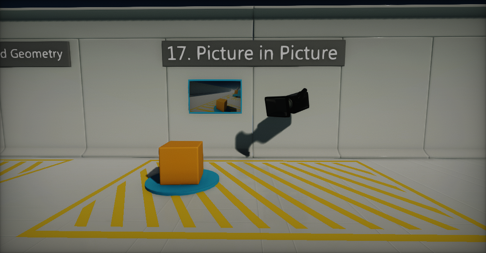
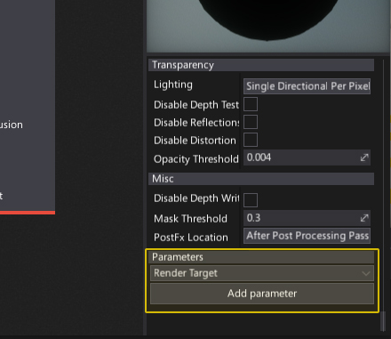
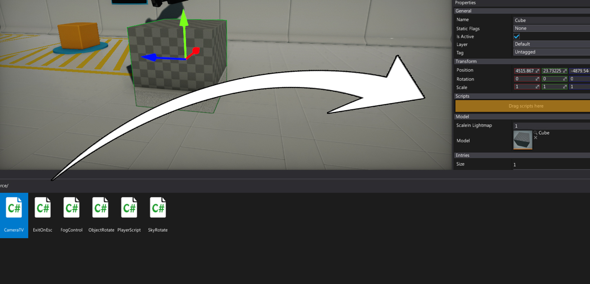
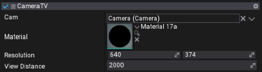

## HOWTO: Render a camera to a texture

Flax Engine offers very wide range of customization that can be made to extend the rendering pipeline. One of them is rendering scene using the custom camera right to the render target. Then presenting it on an object surface.

In this tutorial you will learn how to achive picture-in-picture effect:



## Creating material

The first step is to create a dedicated material for the TV object. It will be used to show rendered scane picture on a surface so player could see it. To do that follow these simple steps:

1. Create new empty material, and name it `TV Material` (see [Materials Basics](../materials/basics/index.md) page to learn how to do it)

2. Open it in Material Editor (double-click on an asset)
   

3. Scroll down the *Properties Panel*, select **Render Target** option from the bottom drop down menu and press **Add parameter** button
   <br>

4. Right-click on created *New parameter*, select option **Rename** and set its name to **Image**

5. Right-click on a Surface background and create **Get Parameter** node (to learn more about creating nodes see [Material Editor](../materials/material-editor/index.md) page)
   

6. Select **Image** parameter from the dropdown menu of that node and connect it's **Color** box with Material **Emissive** input.
   <br>

7. **Save** the material asset

## Creating a script

Now it's time to write a simple script that will use a camera and render it to the texture (which is also called a *render target*).

1. Navigate to *Source* directory of your project and create new C# script with name **CameraTV**
   

2. Open the script

3. Write the following code and save it

```cs
using System;
using FlaxEngine;

public class CameraTV : Script
{
    public Camera Cam;
    public MaterialBase Material;

    [Limit(1, 2000)]
    public Vector2 Resolution
    {
        get { return _resolution; }
        set
        {
            value = Vector2.Clamp(value, new Vector2(1), new Vector2(2000));
            if (_resolution != value)
            {
                _resolution = value;
                if (_output)
                {
                    // Resize backbuffer
                    _output.Init(PixelFormat.R8G8B8A8_UNorm, (int) _resolution.X, (int) _resolution.Y);
                }
            }
        }
    }

    private Vector2 _resolution = new Vector2(640, 374);
    private RenderTarget _output;
    private SceneRenderTask _task;
    private MaterialInstance _material;

    public override void OnEnable()
    {
        // Create backbuffer
        if (_output == null)
            _output = RenderTarget.New();
        _output.Init(PixelFormat.R8G8B8A8_UNorm, (int) _resolution.X, (int) _resolution.Y);

        // Create rendering task
        if (_task == null)
            _task = FlaxEngine.Object.New<SceneRenderTask>();
        _task.Order = -100;
        _task.Camera = Cam;
        _task.Output = _output;
        _task.Enabled = false;

        if (Material && _material == null)
        {
            // Use dynamic material instance
            if (Material.WaitForLoaded())
                throw new Exception("Failed to load material.");
            _material = Material.CreateVirtualInstance();

            // Set render task output to draw on model
            _material.GetParam("Image").Value = _output;

            // Bind material to parent model
            if (Actor is StaticModel staticModel && staticModel.Model)
            {
                staticModel.Model.WaitForLoaded();
                staticModel.Entries[0].Material = _material;
            }
        }

        _task.Enabled = true;
    }

    public override void OnDisable()
    {
        // Ensure to cleanup resources
        Destroy(ref _task);
        Destroy(ref _output);
        Destroy(ref _material);
    }
}
```

## Preparing objects

The final step is to set up a scene and link all this stuff together.

1. Create new **Camera** object and place it in your scene
2. Add object that will present a camera image. You can use **Cube** model from the *Toolbox* window
   

3. Select spawned object and add **CameraTV** script to it by simply draging it
   

4. Set reference to the camera and material for script properties **Cam** and **Material**. You can also adjust the resolution (in pixels).
   <br>

5. Hit **Play** and see the results!
   
