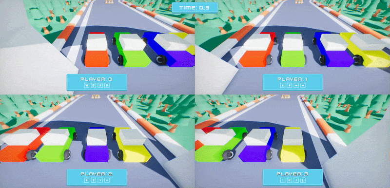

# Split Screen



Camera and UI Canvas contain the property `Viewport Rect` which defines the area of the output image/screen to fill when drawing the game or UI. This can be used to achieve split-screen rendering for local co-op games.

Engine draws the main game view using the first camera (or overridden one by cut-scene/gameplay) from `Camera.MainCamera`. The main view is drawn using `MainRenderTask.Instance` which takes that main camera view properties and draws it to the output. Game can create own `SceneRenderTask` for other local players that would composte to the same main game output.

See a simple local co-op [racing game project](https://github.com/FlaxEngine/SplitScreenSample) made with [Arizona Framework](https://github.com/FlaxEngine/ArizonaFramework). Contains arcade-like vehicle controls with cartoon visuals and sounds.

To control the viewport for the main camera (eg. 1st player) use the following code:

```cs
var viewport = new Float4(0, 0, 0.5f, 1); // Based on the number of players and a way to split the screen
var task = MainRenderTask.Instance;
Camera.MainCamera.ViewportRect = viewport;
var canvas = MainPlayerCanvas; // From game-specific code
canvas.ViewportRect = viewportRect;
```

For other players, spawn a custom render task with canvas to assign their viewports. Player UI can be spawned from prefab and use the root actor as UI Canvas.

```cs
var task = new SceneRenderTask();
task.Order = 10 + PlayerIndex; // Draw after the main and in stable order
task.SwapChain = MainRenderTask.Instance.SwapChain; // Sync output window (for game)
task.Output = MainRenderTask.Instance.Output; // Sync output image (for editor)
task.IsComposite = true; // Indicate the output buffer is linked, not owned
task.Camera = PlayerCamera; // Link camera actor used by this player
var viewport = new Float4(0, 0, 0.5f, 1); // Based on the number of players and a way to split the screen
task.Camera.ViewportRect = viewport;
var canvas = PlayerCanvas; // From game-specific code
canvas.ViewportRect = viewportRect;

// OnDestroy:
// Be sure to cleanup allocated object after gameplay ends of player disconnects
Delete(task);
```
