# Debug View

For more advanced graphics debugging and scene rendering preview you can use **Debug View**. This feature allows to output one of the intermediate buffers or show the special rendering features debug view.

It's avaliable to use in every Editor viewport by using **View -> Debug View**.

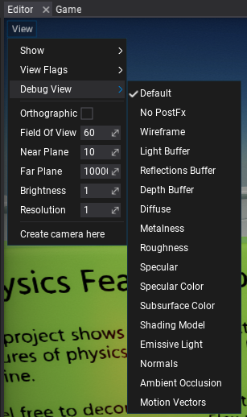

The full list of options and the documentation is available [here](https://docs.flaxengine.com/api/FlaxEngine.ViewMode.html).

You can also adjust those options from code:

# [C++](#tab/code-cpp)
```cpp
#include "Engine/Graphics/RenderTask.h"

MainRenderTask::Instance->View.Mode = ViewMode::Diffuse;
```
# [C#](#tab/code-csharp)
```cs
MainRenderTask.Instance.View.Mode = ViewMode.Diffuse;
```
***

## General

### Default

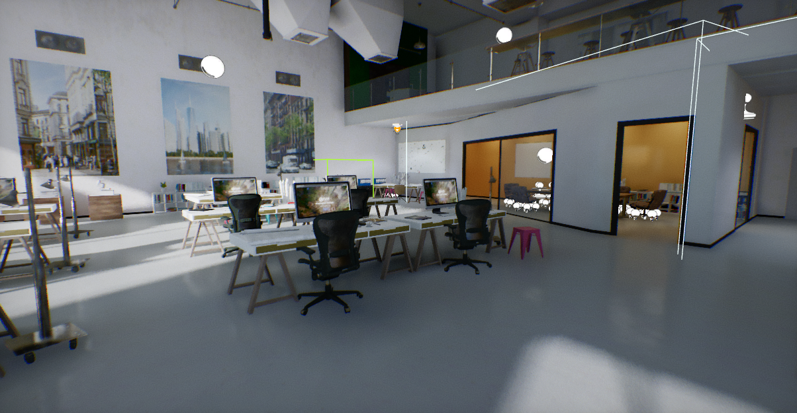

**Default** view mode shows the final result of the scene with all materials, lighting and post-processing applied.

### Unlit

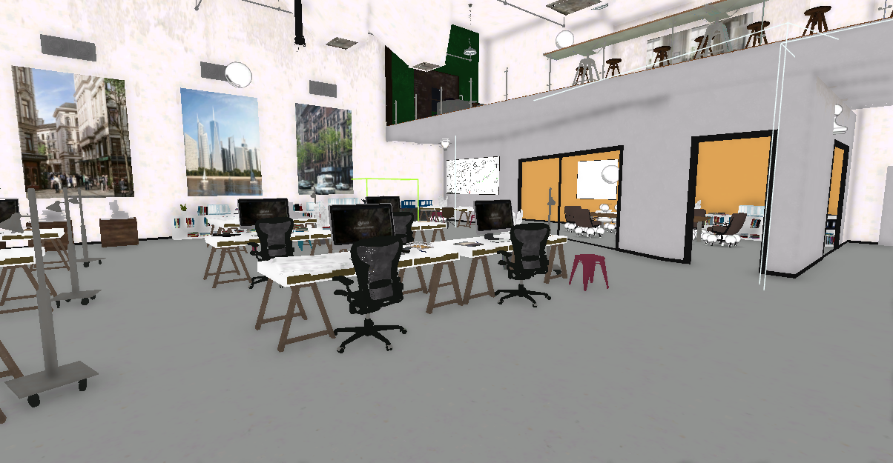

**Unlit** view mode shows the material colors with ambient occlusion.

### No PostFx


**No PostFx** view mode shows the scene with materials and lighting applied but without any post-processing.

### Wireframe

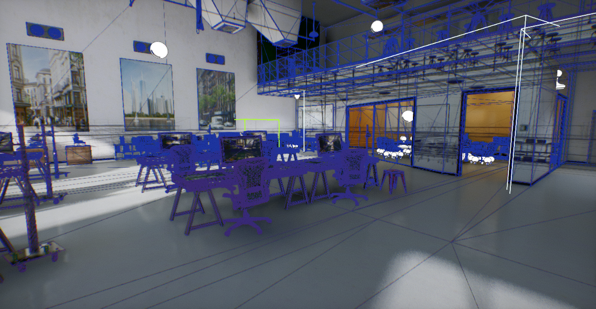

**Wireframe** view mode shows all polygon edges over the scene. Occluded edge pixels are darker and semi-transparent. Available only in non-Release builds and Editor.

### Lighting

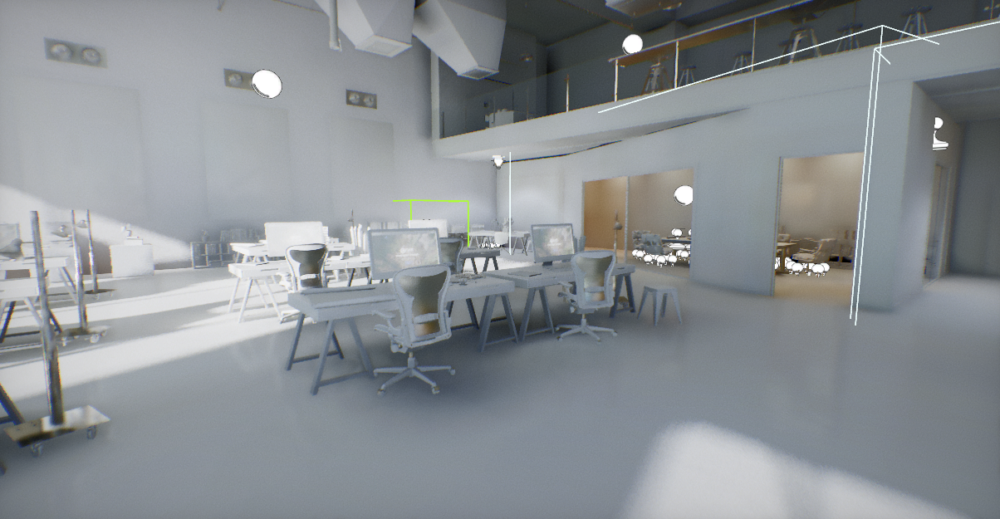

**Lighting** view mode shows lighting without diffuse color from materials to inspect both diffuse and specular light contributions.

### Reflections

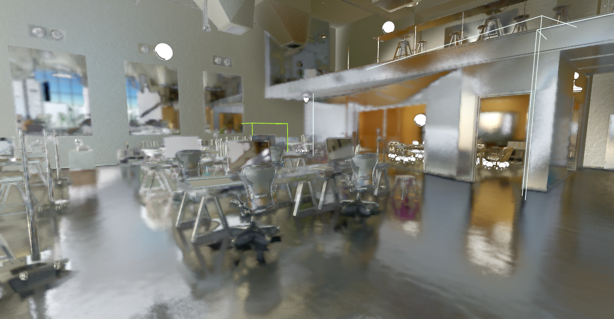

**Reflections** view mode shows specular reflections lighting as if all materials were metal.

### Lightmap UVs Density

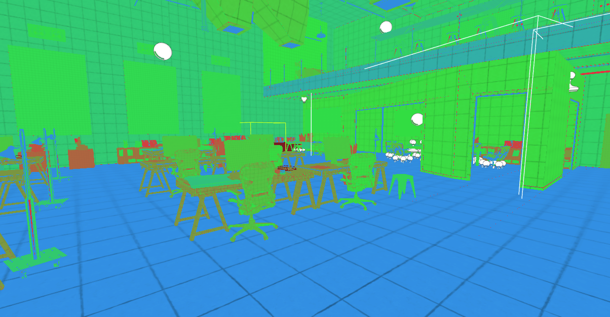

**Lightmap UVs Density** view mode shows the lightmap density of objects. Color coding is used to display density with a grid that maps to the actual lightmap texels.

### Physics Colliders

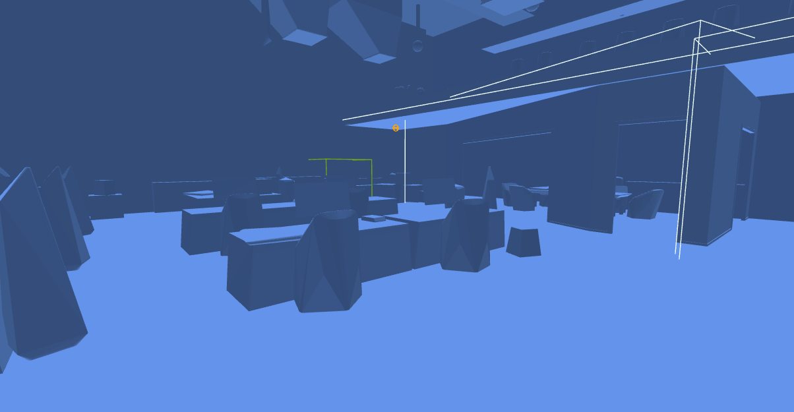

**Physics Colliders** view mode shows physics collider meshes. Dynamic and kinematic objects use coloring to distinguish them from the static environment.

## GBuffer

### Depth Buffer

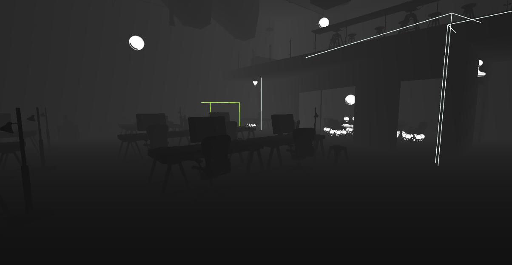

**Depth Buffer** view mode shows the gradient based on pixels depth from camera (black to white).

### Diffuse

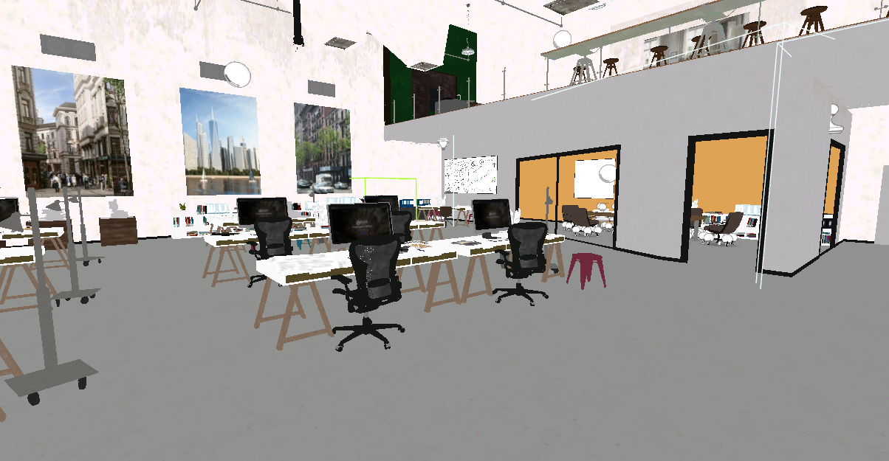

**Diffuse** view mode shows materials diffuse color.

### Roughness

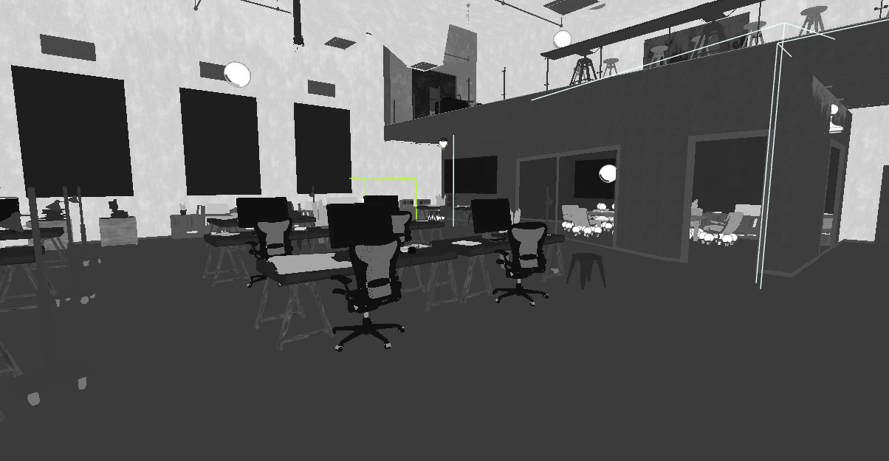

**Roughness** view mode shows materials roughness value.

### Normals

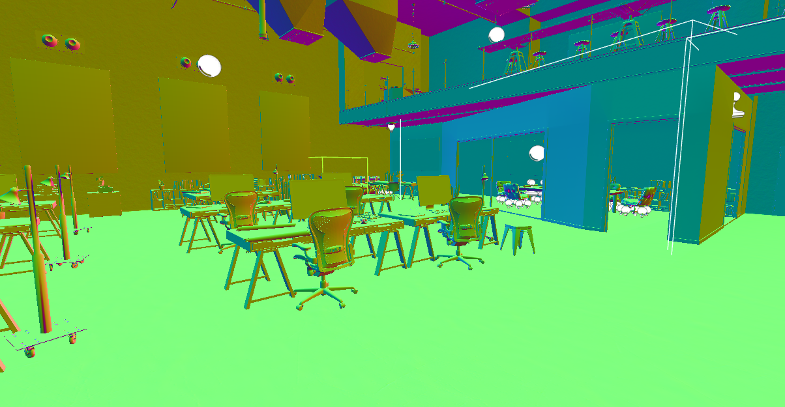

**Normals** view mode shows materials surface normals.

### Motion Vectors

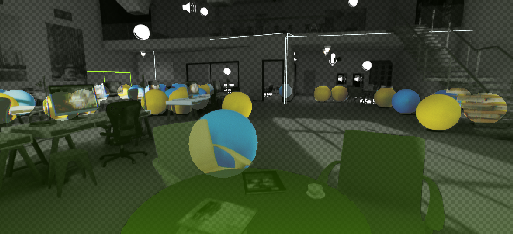

**Motion Vectors** view mode shows motion of pixels in a screen-space (color based on direction). Static surfaces are rendered in grayscale, while dynamic objects are rendered on top with colors.

## Optimization

### LOD Preview

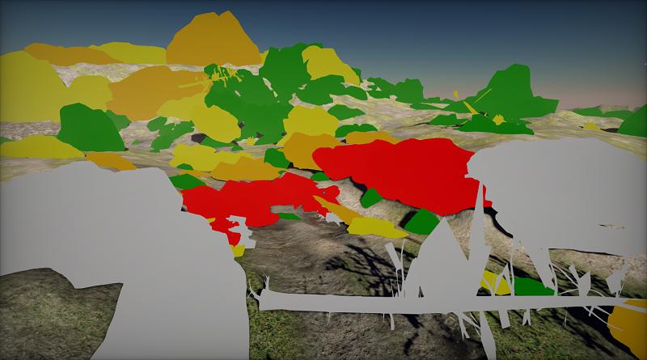

**LOD Preview** shows scene meshes in colors based on the LOD index. This comes handy when debugging model LODs transitions based on distance or object screen-size. The table below shows the legend of the colors used for this debug view.

| LOD 0 | LOD 1 | LOD 2 | LOD 3 | LOD 4 | LOD 5 |
|--------|--------|--------|--------|--------|--------|
|  White <div style="background-color: white; width: 10px; padding: 10px; border: 1px solid black;"> | Red <div style="background-color: red; width: 10px; padding: 10px; border: 1px solid black;"> | Orange <div style="background-color: orange; width: 10px; padding: 10px; border: 1px solid black;"> | Yellow <div style="background-color: yellow; width: 10px; padding: 10px; border: 1px solid black;"> | Green <div style="background-color: green; width: 10px; padding: 10px; border: 1px solid black;"> | Blue <div style="background-color: blue; width: 10px; padding: 10px; border: 1px solid black;"> |

### Material Complexity

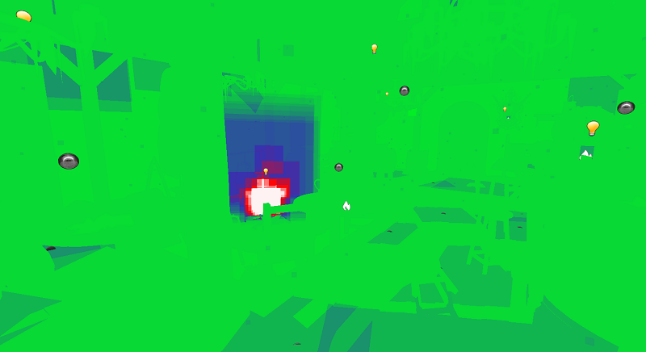

**Material Complexity** shows per-pixel complexity of the materials rendering. It colors the pixels based on the number of shader instructions, blending mode used, textures usage, and tessallation usage. This works in general as a good indication of performance metric of the materials and can be used to analyze and optimize scenes. The table below shows the legend of the colors used for this debug view.

| Ideal | Good | Complex | Expensive |
|--------|--------|--------|--------|
|  Green <div style="background-color: #00f71e; width: 10px; padding: 10px; border: 1px solid black;"> | Blue <div style="background-color: #3333b2; width: 10px; padding: 10px; border: 1px solid black;"> | Red <div style="background-color: #ff0000; width: 10px; padding: 10px; border: 1px solid black;"> | White <div style="background-color: #fff2f2; width: 10px; padding: 10px; border: 1px solid black;"> |

### Quad Overdraw

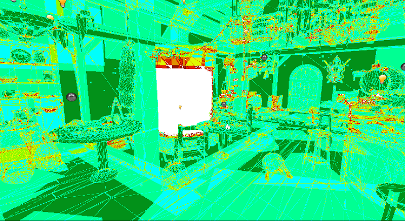

**Quad Overdraw** shows per-pixel overdraw that accumulates during scene rendering. It is useful when analyzing geometry complexity (eg. too high poly meshes), models culling, and analyze overdraw from other objects such as particles and decals. The table below shows the legend of the colors used for this debug view based on the amount of triangles covering given pixel.

| 1 | 2 | 3 | 4 | 5 | 6 | 7 | 8 |
|--------|--------|--------|--------|--------|--------|--------|--------|
| <div style="background-color: #029319; width: 10px; padding: 10px; border: 1px solid black;"> | <div style="background-color: #00ff95; width: 10px; padding: 10px; border: 1px solid black;"> | <div style="background-color: #00fffd; width: 10px; padding: 10px; border: 1px solid black;"> | <div style="background-color: #8efa00; width: 10px; padding: 10px; border: 1px solid black;"> | <div style="background-color: #fffb00; width: 10px; padding: 10px; border: 1px solid black;"> | <div style="background-color: #ff9300; width: 10px; padding: 10px; border: 1px solid black;"> | <div style="background-color: #941100; width: 10px; padding: 10px; border: 1px solid black;"> | <div style="background-color: #ffffff; width: 10px; padding: 10px; border: 1px solid black;"> |

Reference: [https://blog.selfshadow.com/2012/11/12/counting-quads/](https://blog.selfshadow.com/2012/11/12/counting-quads/)

### Light Overlap

**Light Overlap** shows the local light volumes overlaps complexity to visualize how many lights affect each pixel (for performance optimization).

### Global SDF Overdraw

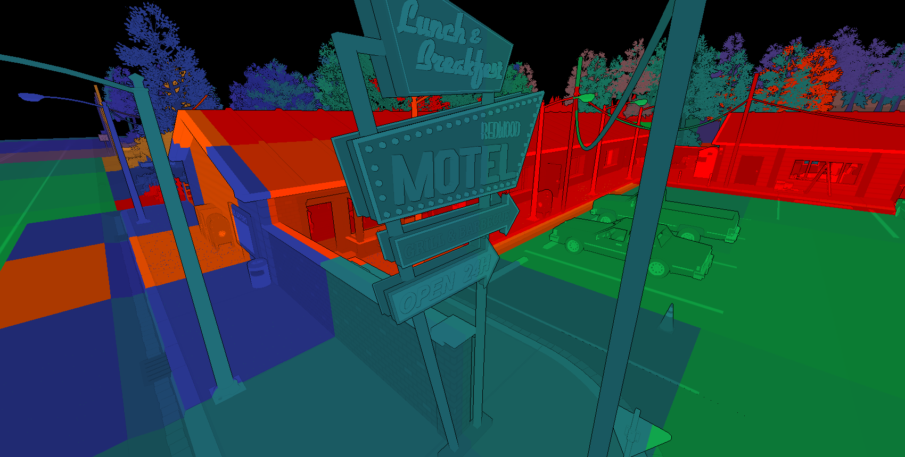

**Global SDF Overdraw** shows complexity and overdraw when rendering Global SDF from model/terrain SDFs. It's usefull when profiling slow Global SDF for a specific scenes. Dynamic objects or tooo many objects affect the complexity of the SDF rasterization process.

| Ideal | Good | Complex | Expensive |
|--------|--------|--------|--------|
|  Green <div style="background-color: #00f704; width: 10px; padding: 10px; border: 1px solid black;"> | Blue <div style="background-color: #3333b2; width: 10px; padding: 10px; border: 1px solid black;"> | Orange <div style="background-color: #ff9500; width: 10px; padding: 10px; border: 1px solid black;"> | Red <div style="background-color: #ff0000; width: 10px; padding: 10px; border: 1px solid black;"> |
