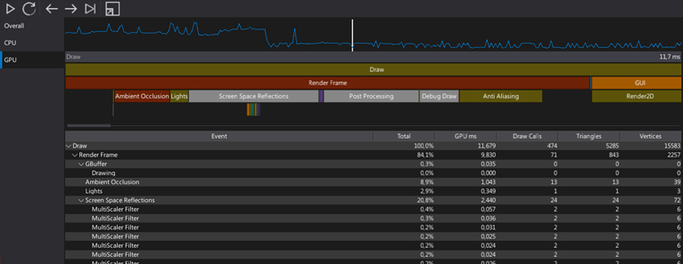

# Profiler



Profilling game performance is very important aspect in the development process. Flax Editor contains dedicated set of tools for this. **Profiler** window provides various ways of meausing game performance and helps the optimization process.

## Interface


Profiler window is divided into 3 parts:
* Toolbar
* Sections list
* Detaisl panel

## Sections

### Overall

The general profiling mode with major game performance charts and stats.

### CPU

The CPU performance profiling mode.

To add code section to be included in profile blocks use the following code:

```
// C#
Profiler.BeginEvent("MyFunction");
// do something
Profiler.EndEvent();
```

### GPU

The GPU performance profiling mode.

To add code section to be included in profile blocks use the following code:

```
// C#
Profiler.BeginEventGPU("MyFunction");
// do something on GPU with GPUContext
Profiler.EndEventGPU();
```

### Memory

The memory profiling mode focused on system memory allocations breakdown.

