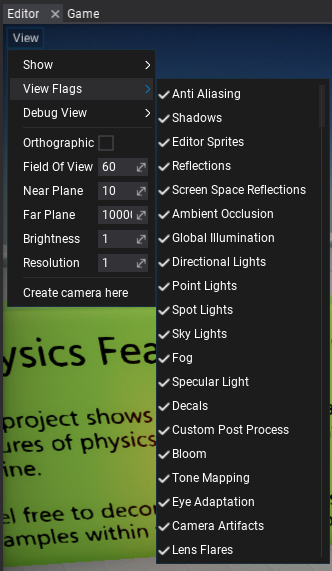

# View Flags

**View Flags** are used to enable or disable various rendering features. This can be useful when debugging the graphics or when tweaking the graphics rendering for the game.

Every viewport in Editor has options to configure its rendering flags using **View -> View Flags** as shown on the picture below.



The full list of options and the documentation is available [here](https://docs.flaxengine.com/api/FlaxEngine.ViewFlags.html).

You can also adjust those options from code:

```cs
MainRenderTask.Instance.View.Flags |= ViewFlags.PhysicsDebug;
```
