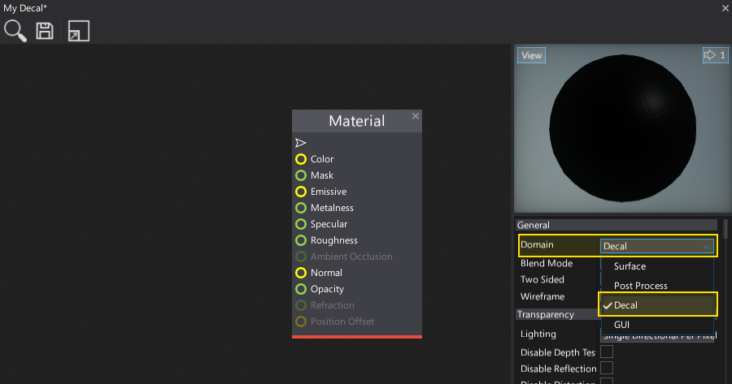
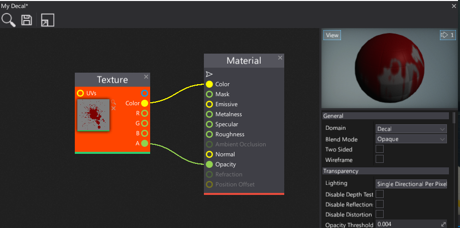
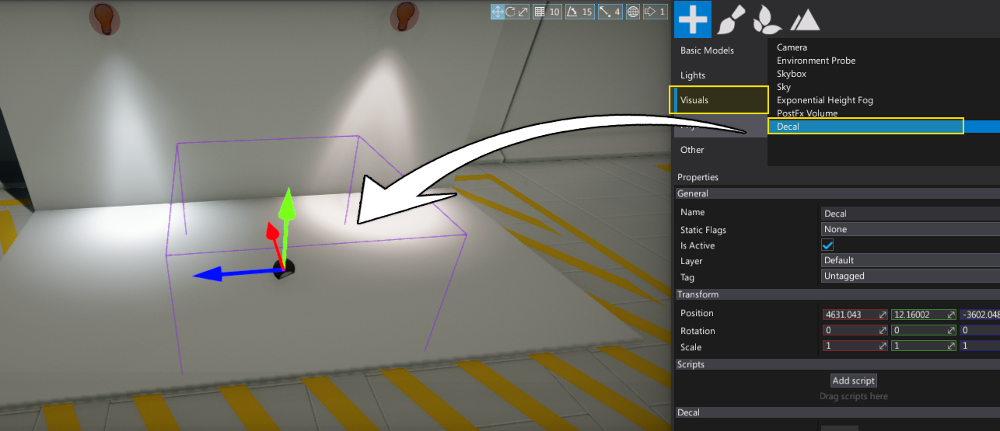
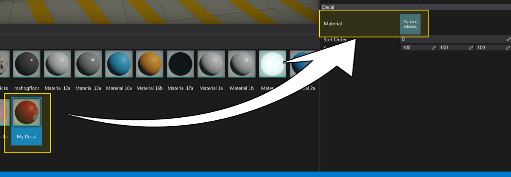
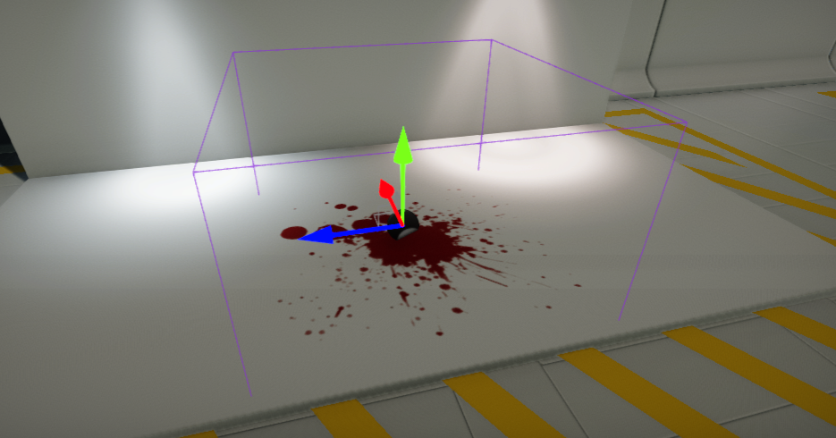

# HOWTO: Create a decal

In this tutorial, you will learn how to create and use decal. Follow the instructions to create a simple blood stain. If you need the requried texture checkout the official [Flax Samples](https://github.com/FlaxEngine/FlaxSamples) to get one.

## 1. Create material

The first step is to create a new material asset (see [Materials Basics](../materials/basics/index.md) page to learn how to do it).

## 2. Set Domain to Decal

Next step is to open the material editor and change the material **Domain** to **Decal** as shown in the picture below.

## 3. Add decal texture

Now drag and drop the texture you want to draw as a decal. Then connect it with material color and opacity properties as show in the picture below. Also you can see the preview of the decal in the Material Preview panel.

## 4. Save material

Press **Ctrl+S** or click the **Save** button to save the changes in the material asset.

## 5. Create Decal actor

Now add a new [Decal](decal.md) actor to your scene. You can drag and drop it from the *Toolbox Window* (**Visuals** tab) or use a *Scene Tree Window* and the dedicated context menu.

## 6. Assign material

Select the created decal actor and assign the material to its property **Material**.

## 7. See the results

Your decal is ready. You can use it in your game. Also, decals can be spawned at runtime via C# script and you can create a virtual dynamic material instance to modify the decal parameters, for instance: fade off the decal after a timeout.
