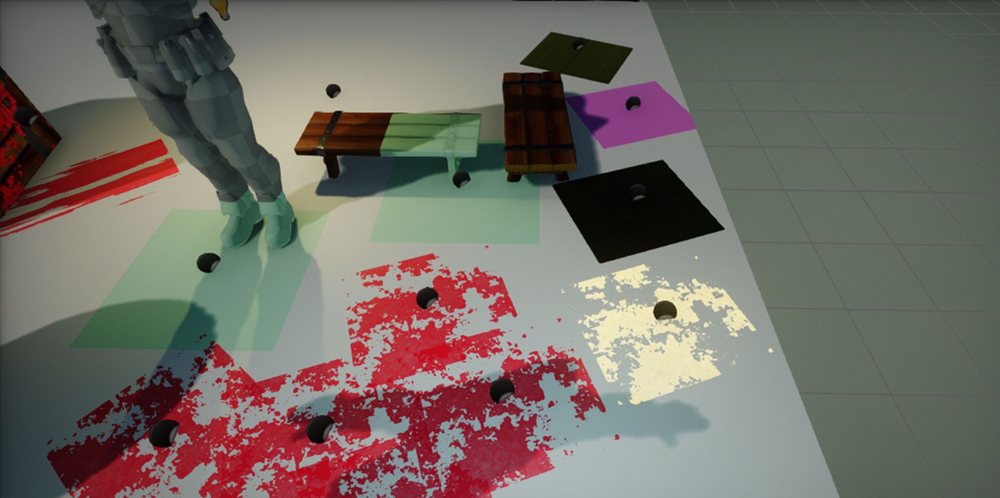
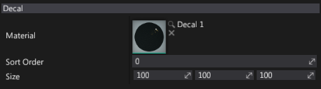

# Decal

**Decal** is an actor type that projects and renders the material on top of the other objects. A Decal uses an oriented bounding box to define its volume.

## Usage

To learn how to setup and use the decal please see the dedicated tutorial: [How to create a decal](create-decal.md).

## Properties

| Option | Description |
|--------|--------|
| **Material** | The decal material. Must have the domain mode set to *Decal* type. |
| **Sort Order** | The decal rendering order. Higher values are rendered later (on top). |
| **Render Layers Mask** | The layers mask used for render composition. Can be used to include or exclude specific actor layers from the drawing on top of them. |
| **Size** | The decal bounds size (in local space). |
| **Draw Min Screen Size** | The minimum screen size for the decal drawing. If the decal size on the screen is smaller than this value then decal will be culled. Set it to higher value to make culling more aggressive. |
