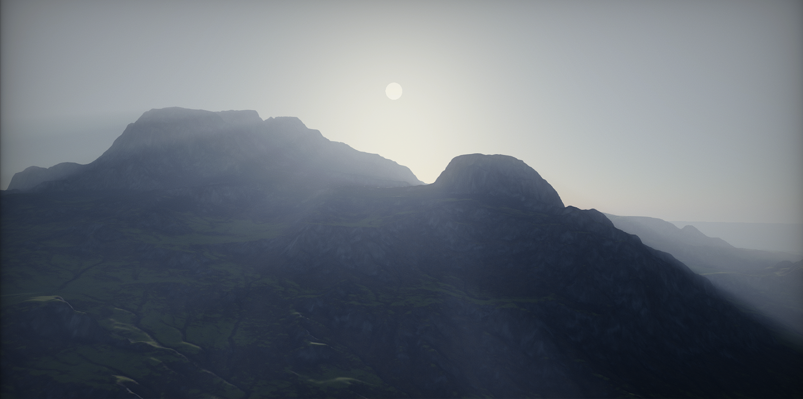
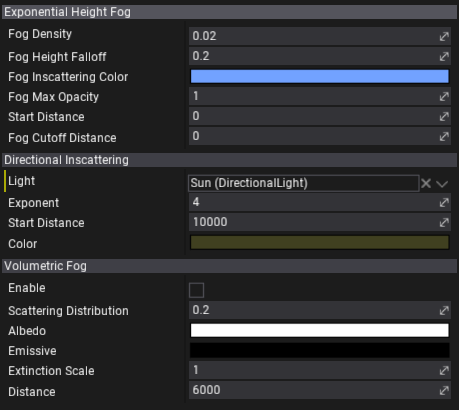

# Exponential Height Fog

**Exponential Height Fog** actor is used to create fogging effects such as clouds but with a density that is related to the height of the fog. It renders the fog that density grows exponentially based on the height and the falloff parameter. It supports adjusting the fog inscatter color, density, start distance and other artistic parameters.

Also, Exponential Height Fog is used by the [Volumetric Fog](volumetric-fog.md).

## Properties

| Option | Description |
|--------|--------|
| **Fog Density** | Fog density factor. |
| **Fog Height Falloff** | The fog height density factor that controls how the density increases as height decreases. The smaller values produce more visible transition larger. |
| **Fog Inscattering Color** | Fog color. |
| **Fog Max Opacity** | Maximum opacity of the fog. |
| **Start Distance** | Distance from the camera that the fog will start, in world units. |
| **Fog Cutoff Distance** | Scene elements past this distance will not have fog applied. Value 0 disables it. |
| *Directional Inscattering* |
| **Light** | Directional light actor used for Directional Inscattering. |
| **Exponent** | Controls the size of the directional inscattering cone used to approximate inscattering. |
| **Start Distance** | Controls the start distance from the viewer of the directional inscattering, which is used to approximate inscattering. |
| **Color** | Controls the color of the directional inscattering, which is used to approximate inscattering from a directional light. |
| *Volumetric Fog* |
| **Enable** | Whether to enable Volumetric fog. Graphics quality settings control the resolution of the fog simulation. |
| **Scattering Distribution** | Controls the scattering phase function - how much incoming light scatters in various directions. |
| **Albedo** | The height fog particle reflectiveness used by volumetric fog. Water particles in air have an albedo near white, while dust has slightly darker value. |
| **Emissive** | Light emitted by height fog. This is a density so more light is emitted the further you are looking through the fog. |
| **Extinction Scale** | Scales the height fog particle extinction amount used by volumetric fog. Values larger than 1 cause fog particles everywhere absorb more light. |
| **Distance** | Distance over which volumetric fog should be computed. Larger values extend the effect into the distance but expose under-sampling artifacts in details. |
