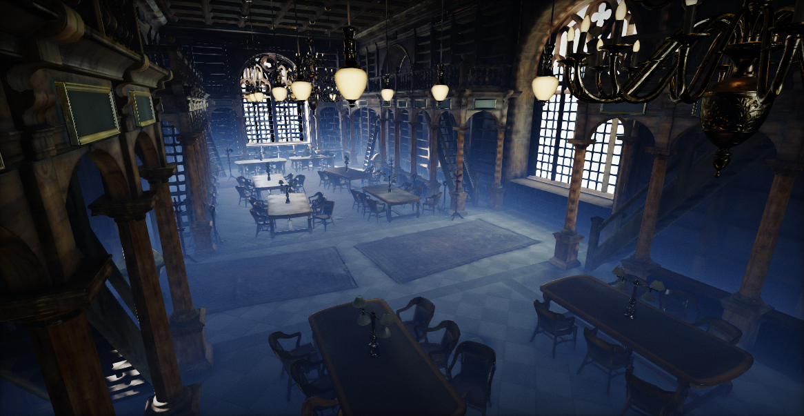

# Fog Effects

Flax supports various ways of adjusting the scene lighting and applying fog. This documentation section covers fog effects and describes how to use them in your games.

* [Exponential Height Fog](exponential-height-fog.md)
* [Volumetric Fog](volumetric-fog.md)
